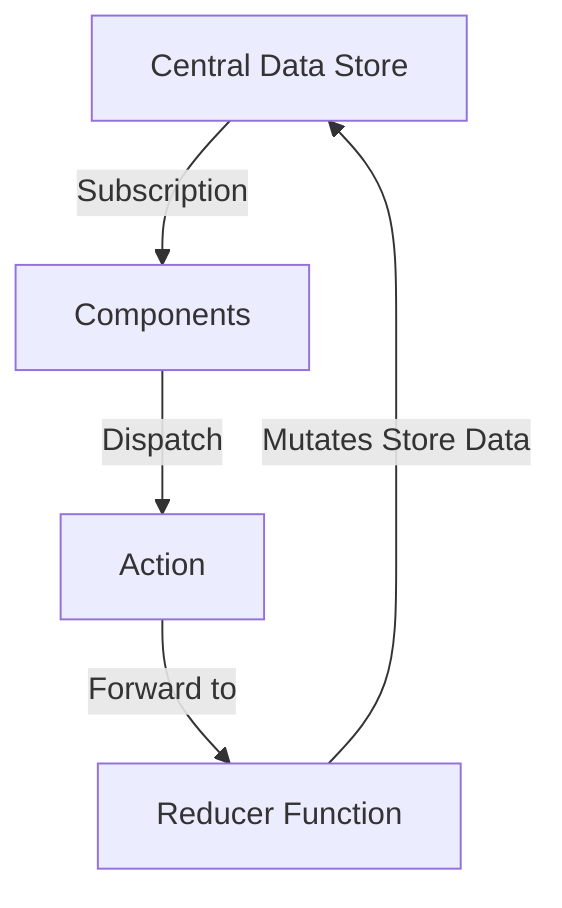

# React Complete Guide

Demo sites

- Expense: https://ianchen0419.github.io/react-complete-guide/expense/index.html
- Couse Goal: https://ianchen0419.github.io/react-complete-guide/course-goal/index.html
- User Age: https://ianchen0419.github.io/react-complete-guide/user-age/index.html
- Login Panel: https://ianchen0419.github.io/react-complete-guide/login-panel/index.html
- React Meals: https://ianchen0419.github.io/react-complete-guide/react-meals/index.html
- Redux Counter: https://ianchen0419.github.io/react-complete-guide/redux-counter/index.html
- Redux Cart: https://ianchen0419.github.io/react-complete-guide/redux-cart/index.html
- React Router: https://ianchen0419.github.io/react-complete-guide/react-router/index.html
- Great Quotes: https://ianchen0419.github.io/react-complete-guide/great-quotes/index.html

## Archived Projects

- Expense - https://github.com/ianchen0419/react-complete-guide/tree/expense
- Couse Goal - https://github.com/ianchen0419/react-complete-guide/tree/course-goal
- User Age - https://github.com/ianchen0419/react-complete-guide/tree/user-age
- Login Panel - https://github.com/ianchen0419/react-complete-guide/tree/login-panel
- React Meals - https://github.com/ianchen0419/react-complete-guide/tree/react-meals
- Redux Counter - https://github.com/ianchen0419/react-complete-guide/tree/redux-counter
- Redux Cart - https://github.com/ianchen0419/react-complete-guide/tree/redux-cart
- React Router - https://github.com/ianchen0419/react-complete-guide/tree/react-router
- Great Quotes - https://github.com/ianchen0419/react-complete-guide/tree/great-quotes

## Airbnb ESLint Rules

## Learning Memo

### props

用於兩個元件之間傳遞資訊使用，比如 A 元件裡面有 B 元件

```js:A.js
import B from './B.js'

function A() {
  return <B title="hey" name="cool" />
}

```

```js:B.js
function B(props) {
  console.log(props); // {title: "hey", name: "cool"}

  return ...省略...
}

```

### Wrapper Components

一個 Component 裡面挖一個洞，可以填任何東西 inner
比方說 Card Component，裡面可以包東西。使用 Card 時要用這種方式`<Card>東西放這裡</Card>`

`props.children`是特別的名稱，雖然沒有指定，但是是指包在 Tag 裡面的東西

```js:Card.js
function Card(props) {
  const classes = 'card ' + props.className;
  return <div className={classes}>{props.children}</div>;
}
```

```js:A.js
function A() {
  function A() {
    return (
      <Card className="anotherClassOK">
        <h2>ALOHA!</h2>
      </Card>
    )
  }
}
```

### JSX

jsx 是一種語法，原本的用法是`React.createElement()`

例如，這是一段 jsx

```js
function App() {
  return (
    <div>
      <h2>Let&apos;s get start</h2>
      <Expenses items={expense} />
    </div>
  );
}
```

它翻譯成`React.createElement()`後會變這樣

```js
import React from 'react';

function App() {
  return React.createElement(
    'div',
    {},
    React.createElement('h2', {}, 'Let&apos;s get start'),
    React.createElement(Expenses, { items: expense }),
  );
}
```

### Arrow Function Syntax

傳統的 Function 長這樣

```js:App.js
function App() {
  return ...;
}
export default App;
```

寫成 Arrow Function 以後變這樣

```js:App.js
const App = () => {
  return ...;
}
export default App;
```

### useState

useState 是一個 hook

功能：當按鈕點擊後，改變標題的文字內容

```js
import React, { useState } from 'react';

function ExpenseItem(props) {
  const [title, setTitle] = userState(props.title); // useState必須放在Function的Direct Scope

  function clickHandler() {
    setTitle('Updated');
  }

  return (
    <div>
      <h2>{title}</h2>
      <button onClick={clickHandler}></button>
    </div>
  );
}
```

### onChange 拿到 input 的 value

```js
function Form() {
  function changeHandler(event) {
    console.log(event.target.value);
  }

  return <input onChange={changeHandler} />;
}
```

### Multilple State and Single State

這是 Multiple State

```js
function Form() {
  const [enteredTitle, setEnteredTitle] = useState('');
  const [enteredAmount, setEnteredAmount] = useState('');
  const [enteredDate, setEnteredDate] = useState('');

  function titleChangeHandler(event) {
    setEnteredTitle(event.target.value);
  }

  function amountChangeHandler(event) {
    setEnteredAmount(event.target.value);
  }

  function dateChangeHandler(event) {
    setEnteredDate(event.target.date);
  }

  return (
    <form>
      <input onChange={titleChangeHandler}>
      <input onChange={amountChangeHandler}>
      <input onChange={dateChangeHandler}>
    </form>
  );
}
```

Single State

```js
function Form() {
  const [userInput, setUserInput] = useState({
    enteredTitle: '',
    enteredAmount: '',
    enteredDate: '',
  });

  function titleChangeHandler(event) {
    setUserInput({
      ...userInput, // 必須要Copy剩下的，不然會遺失掉剩下的
      enteredTitle: event.target.value,
    });
  }

  function amountChangeHandler(event) {
    setUserInput({
      ...userInput,
      enteredAmount: event.target.value,
    });
  }

  function dateChangeHandler(event) {
    setUserInput({
      ...userInput,
      enteredDate: event.target.value,
    });
  }

  return (
    <form>
      <input onChange={titleChangeHandler}>
      <input onChange={amountChangeHandler}>
      <input onChange={dateChangeHandler}>
    </form>
  );
}
```

### 更新 State 的方式

如果有一串 State，但是只需要更新其中一項，有兩種做法

第一種

```js
function Form() {
  const [userInput, setUserInput] = useState({
    enteredTitle: '',
    enteredAmount: '',
    enteredDate: '',
  });

  function titleChangeHandler(event) {
    setUserInput({
      ...userInput,
      enteredTitle: event.target.value,
    });
  }

  return (
    <form>
      <input onChange={titleChangeHandler}>
      <input onChange={amountChangeHandler}>
      <input onChange={dateChangeHandler}>
    </form>
  );
}
```

第二種：第二種比較好，因為 prevState 拿到的資料比較即時

```diff js
function Form() {
  const [userInput, setUserInput] = useState({
    enteredTitle: '',
    enteredAmount: '',
    enteredDate: '',
  });

  function titleChangeHandler(event) {
+   setUserInput((prevState) => ({
+     ...prevState,
+     enteredTitle: event.target.value,
+   }));
  }

  return (
    <form>
      <input onChange={titleChangeHandler}>
      <input onChange={amountChangeHandler}>
      <input onChange={dateChangeHandler}>
    </form>
  );
}
```

### Two-way binding

首先先處理 useState，讓 input 每次 change 都可以抓到改變的值

```js
function Form() {
  const [enteredTitle, setEnteredTitle] = useState('');

  function changeHandler(event) {
    setEnteredTitle(event.target.value)
  }

  function submitHandler(event) {
    event.preventDefault();
  }

  return (
    <form onSubmit={}>
      <input type="text" onChange={changeHandler} />
      <button type="submit">Submit</button>
    </form>
  );
}
```

接下來處理 two-way binding，當輸入完輸入資訊後，按下 Submit 按鈕，要清空輸入框的內容
two-way binding 的寫法是`value={enteredtitle}`

```diff js
function Form() {
  const [enteredTitle, setEnteredTitle] = useState('');

  function changeHandler(event) {
    setEnteredTitle(event.target.value)
  }

  function submitHandler(event) {
    event.preventDefault();
+   console.log(enteredTitle); // 拿到輸入的value
+   setEnteredTitle(''); // 清空value的state
  }

  return (
    <form onSubmit={}>
+     <input value={enteredTitle} type="text" onChange={changeHandler} />
      <button type="submit">Submit</button>
    </form>
  );
}
```

### Child-to-Parent 的元件溝通

`<NewExpense />`裡面有`<ExpenseForm />`，當`<ExpenseForm />`的值更新後，要傳更新值給`<NewExpense />`

作法：設計自己的 Event Prop

NewExpense 部分（Parent Component）

```js:NewExpense.js
import ExpenseForm from './ExpenseForm';

function NewExpense() {
  function saveExpenseDataHandler(enteredExpenseData) {
    const expenseData = {
      ...enteredExpenseData,
      id: Math.random().toString(),
    };
  }

  return <ExpenseForm onSaveExpenseData={saveExpenseDataHandler} />
}

export default NewExpense;
```

ExpenseForm 部分（Child Component）

```diff js:ExpenseForm.js
+function ExpenseForm(props) {
  function submitHandler() {
    const expenseData = { title: "aloha" };
+   props.onSaveExpenseData(expenseData);
  }

  return (
    <form onSubmit={submitHandler}>
      <button type="submit"></button>
    </form>
  )
}

export default ExpenseForm
```

資料如果要跨元件傳遞，只能透過 Parent-to-Children 方式，如果是兩個鄰居元件要互傳，那要先鄰居 A→ 傳給 Parent（lifting the state up），再由 Parent→ 傳給鄰居 B

### Component 種類

#### Controll Component

定義：裡面有表單元件，會負責往上傳遞/接收資料
範例：ExpenseFilter

#### Presentational Component

或可稱為 Stateless Component、Dump Component
定義：沒有`useState`的元件

#### Stateful Component

或可稱為 Smart Component
定義：有使用到`useState`的元件
範例：ExpenseForm

### Dynamic List

資料流部分：初始資料 + 更新資料

首先定義初始資料

```js:App.js
import Expenses from './components/Expenses/Expenses';
import NewExpense from './components/NewExpense/NewExpense';

const DUMMY_EXPENSES = [ ...省略... ];

function App(
  function addExpenseHandler(expense) {
    console.log(expense); // 每當NewExpense底下的form有送出新資料，這裡就會收到新的expense
  }

  return (
    <NewExpense onAddExpense={addExpenseHandler} />
    <Expenses />
  );
);

export Default App();
```

再來用 useState 直接設定初始值，然後傳到到裡面的元件裡

```diff js:App.js
+import React, { useState } from 'react';
import Expenses from './components/Expenses/Expenses';
import NewExpense from './components/NewExpense/NewExpense';

const DUMMY_EXPENSES = [ ...省略... ];

function App(
+ const [expenses, setExpenses] = useState(DUMMY_EXPENSES);

  function addExpenseHandler(expense) {
    console.log(expense); // 每當NewExpense底下的form有送出新資料，這裡就會收到新的expense
  }

  return (
    <NewExpense onAddExpense={addExpenseHandler} />
+   <Expenses items={expenses} />
  );
);

export Default App();
```

最後加上新資料，更新每次的 expenses

```diff js:App.js
import React, { useState } from 'react';
import Expenses from './components/Expenses/Expenses';
import NewExpense from './components/NewExpense/NewExpense';

const DUMMY_EXPENSES = [ ...省略... ];

function App(
  const [expenses, setExpenses] = useState(DUMMY_EXPENSES);

  function addExpenseHandler(expense) {
-   console.log(expense); // 每當NewExpense底下的form有送出新資料，這裡就會收到新的expense
+   setExpenses([expense, ...expenses]);
  }

  return (
    <NewExpense onAddExpense={addExpenseHandler} />
    <Expenses items={expenses} />
  );
);

export Default App();
```

然後，因為`setExpenses`使用函式的方式呼叫比較好，所以再改成這樣

```diff App.js
function addExpenseHandler(expense) {
-   setExpenses([expense, ...expenses]);
+   setExpenses((prevExpenses) => [expense, ...prevExpenses]);
}
```

### Conditional Content

使用 ternary condition 來寫，可以用小括弧把 Content 包起來

```js
return {
  1 + 1 == 2 ?
  (<p>Hey</p>) :
  (<p>Woo</p>)
};
```

### And Operator

如果條件符合的話，會回傳`&&`後面的內容

```js
1 + 1 == 2 && console.log('y'); // y

1 + 1 == 3 && console.log('y'); // false
```

用 And Operator 簡化 Conditional Content

```js
return (
  { 1 + 1 === 2 && <p>Hey</p> }
  { 1 + 1 !== 2 && <p>Woo</p> }
)
```

### Dynamic Style

需求：做出長條圖，高度由 css 的`height`控制
JSX 的`style={{}}`的第外括號表示要填入 JS 變數，內括號表示一個物件

如果是填入`background-color`這種複合單字，有兩種記法

- 第一種 `<div style={{'background-color': 'red'}}></div>`
- 第二種 `<div style={{backgroundColor: 'red'}}></div>`

```js
unction ChartBar(props) {
  let barFillHeight = '0%';

  if (props.max > 0) {
    barFillHeight = Math.round((props.value / props.max) * 100) + '%';
  }

  return (
    ...
    <div className="chart-bar__fill" style={{height: barFillHeight}}></div>
    ...
  );
}
```

### Dynamic className

```jsx
<label className={`form-control ${!isValid ? 'invalid' : ''}`} htmlFor="goal">
  Course Goal
</label>
```

### Styled Components

#### Button 的用法（Tag selector）

創造出封裝的 CSS 環境，讓元件的 CSS 不會影響外部

使用方法：

首先，引入 styled-components，選用一個 HTML 元件
（例如選用`button`）
然後將 Button.css 的內容貼到``引號之中
並且把原本的 Function Component 刪掉

```js:Button.js
import styled from 'styled-components';

const Button = styled.button`
.button {
  width: 100%;
  font: inherit;
  padding: 0.5rem 1.5rem;
  border: 1px solid #8b005d;
  color: white;
  background: #8b005d;
  box-shadow: 0 0 4px rgba(0, 0, 0, 0.26);
  cursor: pointer;

  @media (min-width: 768px) {
    width: auto;
  }
}

.button:focus {
  outline: none;
}

.button:hover,
.button:active {
  background: #ac0e77;
  border-color: #ac0e77;
  box-shadow: 0 0 8px rgba(0, 0, 0, 0.26);
}
`;

// function Button(props) {
//   return (
//     <button
//       type={props.type === 'submit' ? 'submit' : 'button'}
//       className="button"
//       onClick={props.onClick}
//     >
//       {props.children}
//     </button>
//   );
// }

export default Button;
```

因為`styled.button`就是只 css 的 button selector 了，所以裡面改成 SCSS 風格的寫法

```diff js:Button.js
import styled from 'styled-components';

const Button = styled.button`
-.button {
  width: 100%;
  font: inherit;
  padding: 0.5rem 1.5rem;
  border: 1px solid #8b005d;
  color: white;
  background: #8b005d;
  box-shadow: 0 0 4px rgba(0, 0, 0, 0.26);
  cursor: pointer;
-}

@media (min-width: 768px) {
  width: auto;
}

-.button:focus {
+&:focus {
  outline: none;
}

-.button:hover,
-.button:active {
+&:hover,
+&:active {
  background: #ac0e77;
  border-color: #ac0e77;
  box-shadow: 0 0 8px rgba(0, 0, 0, 0.26);
}
`;
```

#### .form-control 的用法（Class Selector）

```js:CourseInput.js
import styled from 'styled-components';

const FormControl = styled.div`
  margin: 0.5rem 0;

  & label {
    font-weight: bold;
    display: block;
    margin-bottom: 0.5rem;
    color: ${(props) => (props.invalid ? 'red' : 'black')};
  }
}
`

function CourseInput(props) {
  return (
    <form>
      <FormControl invalid={!isValid}>
        <label>Label</label>
        ...
      </FormControl
    </form>
  )
}

export default CourseInput
```

### CSS Modules

CSS Modules 一樣不會影響到 Global 環境，並且是 React 內建支援

首先，把`Button.css`改名為`Button.module.css`

然後，把引入 css 的地方改成這樣

```diff js:Button.js
-import './Button.module.css';
+import styles from './Button.module.css';
```

接下來，把 JSX 的`className`調整成這樣

```diff js:Button.js
-return <button className="button"></button>
+return <button className={styles.button}></button>
```

Button.module.css 內容大概是這樣

```css:Button.module.css
.button {
  font: inherit;
  ...
}

.button:focus {
  outline: none;
}

.button:hover,
.button:active {
  background: #ac0e77;
  ...
}

```

CSS Module 會把對象的 CSS 檔案裡面的 class 作為物件，因為檔案使用了`.button`，所以在 JSX 要寫成`className={styles.button}`

#### CSS Module dynamic style

當 css 有涉入條件判斷時的寫法

```css:CourseInput.module.css
.form-control {
  margin: 0.5rem 0;
}

...省略...

.form-control.invalid label {
  color: red;
}
```

```js:CourseInput.js
import styles from './CourseInput.module.css';

function CourseInput(props) {
  return (
    <div className={`${styles['form-control']} ${!isValid && styles.invalid}`}>
      <label htmlFor="goal">Course Goal</label>
    </div>
  )
}

export default CourseInput;
```

## Custom Element and CSS Module

原生的 HTML Tag（像是`<button>`、`<div>`），React 都會幫忙處理好 CSS Module
但是自製的 Custom Element（像是`<Card/>`），React 不會幫忙做 CSS Module，所以要額外處理

Card 元件：需要引入自己的 CSS（`card.module.css`），也要幫忙看他給其他元件用的時候被加上什麼 className（使用`props.className`處理）

```js:Card.js
import classes from './card.module.css';

function Card(props) {
  return (
    <div className={`${classes.card} ${props.className}`}>
      {props.children}
    </div>
  )
}

export default Card;
```

AddUser 元件（引用 Card 元件）

```js:AddUser
import classes from './AddUser.module.css';

function AddUser() {
  <Card className={classes.input}>
    <input type="text" />
  </Card>
}

export default AddUser;
```

搭配的`AddUser.module.css`

```css:AddUser.module.css
.input {
  margin: 2rem auto;
}
```

## JSX Root Element

JSX 只能允許一個 root element，所以這樣的程式碼是錯的

```js
return (
   <h2>Hi</h2>
   <p>Good</p>
   { !isGood && <p>Are you OK?</p>}
);
```

解法(1)：使用另一個 root element 包覆

```js
return (
  <div>
    <h2>Hi</h2>
    <p>Good</p>
    {!isGood && <p>Are you OK?</p>}
  </div>
);
```

解法(2)：改成 Array 格式（）

- 要記得加上逗號`,`
- 每個 Item Element 要加上`key`
- 條件是內容不用使用大括號`{}`包覆

```js
return [
  <h2 key="heading">Hi</h2>,
  <p key="content">Good</p>,
  !isGood && <p>Are you OK?</p>,
];
```

解法(3)：使用 Wrapper.js
（用法跟用`<div>`包差不多，但是可以解決 div soup 的問題）

```js:Wrapper.js
function Wrapper(props) {
  return props.children;
}

export default Wrapper;
```

```js
import Wrapper from './Wrapper.js';

return (
  <Wrapper>
    <h2>Hi</h2>
    <p>Good</p>
    {!isGood && <p>Are you OK?</p>}
  </Wrapper>
);
```

解法(4)：使用 React.Fragment

```js
return (
  <React.Fragment>
    <h2>Hi</h2>
    <p>Good</p>
    {!isGood && <p>Are you OK?</p>}
  </React.Fragment>
);
```

或也可寫成這樣

```js
return (
  <>
    <h2>Hi</h2>
    <p>Good</p>
    {!isGood && <p>Are you OK?</p>}
  </>
);
```

也可寫成這樣

```js
import React, { useState, Fragment } from 'react';

return (
  <Fragment>
    <h2>Hi</h2>
    <p>Good</p>
    {!isGood && <p>Are you OK?</p>}
  </Fragment>
);
```

### React Portals

在這個範例中，`Modal`被放進去`Form`元件內，這不太合適，因為`Modal`是 overlay 類型的元件，他適合被放在最外層（body 的 direct children），而不是被塞入元件內

```js:Form.js
return (
  <>
    <Modal>
    <p>content</p>
  </>
)
```

利用 React Protals，可以將 overlay 類型的元件放到最外層

首先，修改 public/index.html

```diff html:public/index.html
<body>
  <noscript>You need to enable JavaScript to run this app.</noscript>
+ <div id="backdrop -root"></div>
+ <div id="overlay-root"></div>
  <div id="root"></div>
</body>
```

然後，修改 ErrorModal.js，建立另一個 Function Component
`Backdrop`，並且把原本藏在 ErrorModal 裡面的 backgrop 的 jsx 移出去

```diff js:src/components/UI/ErrorModal.js

+function Backdrop(props) {
+ return <div className={classes.backdrop} onClick={props.onConfirm} role="presentation"></div>
+}

function ErrorModal(props) {
  return (
   <>
-     <div
-       className={classes.backdrop}
-       onClick={props.onConfirm}
-       role="presentation"
-     ></div>
      <Card className={classes.modal}>
        <header className={classes.header}>
          <h2>{props.title}</h2>
        </header>
        <div className={classes.content}>
          <p>{props.message}</p>
        </div>
        <footer className={classes.actions}>
          <Button onClick={props.onConfirm}>Okay</Button>
        </footer>
      </Card>
   </>
  );
}
```

接著，建立 ModalOverlay，並且把 Modal 部分移進去

```diff js:src/components/UI/ErrorModal.js
function Backdrop(props) {
  return (
    <div
      className={classes.backdrop}
      onClick={props.onConfirm}
      role="presentation"
    ></div>
  );
}

+function ModalOverlay(props) {
+  <Card className={classes.modal}>
+      <header className={classes.header}>
+        <h2>{props.title}</h2>
+      </header>
+      <div className={classes.content}>
+        <p>{props.message}</p>
+      </div>
+      <footer className={classes.actions}>
+        <Button onClick={props.onConfirm}>Okay</Button>
+      </footer>
+    </Card>
+}

function ErrorModal(props) {
  return (
    <>
-    <Card className={classes.modal}>
-      <header className={classes.header}>
-        <h2>{props.title}</h2>
-      </header>
-      <div className={classes.content}>
-        <p>{props.message}</p>
-      </div>
-      <footer className={classes.actions}>
-        <Button onClick={props.onConfirm}>Okay</Button>
-      </footer>
-    </Card>
  </>
  );
}
```

然後，引入 ReactDOM，並且在原本的 ErrorModal 內容裡面，使用`ReactDOM.createPortal()`

`ReactDOM.createPortal()`的第一個參數是要渲染的 ReactNode，第二個參數是指向實際的 Real DOM

```diff js:src/components/UI/ErrorModal.js
+import ReactDOM from 'react-dom';

...省略...

function ErrorModal(props) {
  return (
    <>
+      {ReactDOM.createPortal(<Backdrop onConfirm={props.onConfirm} />, document.getElementById('backdrop-root'))}
    </>
  )
}
```

最後，把`ModalOverlay`寫進去，要幫忙傳遞原本的`props.title`、`props.message`、`props.onConfirm`參數

```diff js:src/components/UI/ErrorModal.js
...省略...

function ErrorModal(props) {
  return (
    <>
      {ReactDOM.createPortal(<Backdrop onConfirm={props.onConfirm} />, document.getElementById('backdrop-root'))}
+      {ReactDOM.createPortal(
+        <ModalOverlay
+          title={props.title}
+          message={props.message}
+          onConfirm={props.onConfirm}
+        />,
+        document.getElementById('overlay-root'),
      )}
    </>
  )
}
```

### React Refs

可以使用 Refs 直接獲取 DOM

首先，引入 `useRef`

```diff js:src/components/Users/AddUser.js
-import React, { useState } from 'react';
+import React, { useState, useRef } from 'react';

```

然後在 Function Component 底下使用`useRef()`

```diff js:src/components/Users/AddUser.js
function AddUser(props) {
+  const nameInputRef = useRef();
+  const ageInputRef = useRef();
}
```

接著，對目標的 ReactNode 使用`ref`指向定義好的`useRef()`

```diff js:src/components/Users/AddUser.js
function AddUSer(props) {
  ...省略...

  return (
    <>
+     <input id="username" ref={nameInputRef}>
+     <input id="age" ref={ageInputRef}>
    </>
  )
}
```

這樣就完成了，可以在`addUserHandler()`裡面`console.log`看看

```js:src/components/Users/AddUser.js
function AddUSer(props) {
  ...省略...

  function addUserHandler(event) {
    console.log(nameInputRef, ageInputRef);
  }
}

```

可以使用`nameInputRef.current.value`抓到現在的值，並且將`enteredUsername`代換掉

```diff js:src/components/Users/AddUser.js
function AddUSer(props) {
  function addUserHandler(event) {
+    const nameRefValue = nameInputRef.current.value
+    const ageRefValue = ageInputRef.current.value

-    if (enteredUsername.trim().length === 0 || enteredAge.trim().length === 0) {
+    if (nameRefValue.trim().length === 0 || ageRefValue.trim().length === 0) {
      ...省略
    }

-    if (+enteredAge < 1) {
+    if (+ageRefValue < 1) {
      ...省略
    }

-    props.onAddUser(enteredUsername, enteredAge);
+    props.onAddUser(nameInputRef, ageRefValue);
  }
}
```

也可以用 Refs 的方式完成 Reset 邏輯

```diff js:src/components/Users/AddUser.js
function AddUser(props) {
-  const [enteredUsername, setEnteredUsername] = useState('');
-  const [enteredAge, setEnteredAge] = useState('');

  ...省略

  function addUserHandler(event) {
    ...省略
-    setEnteredUsername('');
-    setEnteredAge('');


+    nameInputRef.current.value = '';
+    ageInputRef.current.value = '';
  }

-  function usernameChangeHandler(event) {
-    setEnteredUsername(event.target.value);
-  }

-  function ageChangeHandler(event) {
-    setEnteredAge(event.target.value);
-  }

  return (
    <>
      <input
-       onChange={usernameChangeHandler}
-       value={enteredUsername}
        id="username"
        type="text"
        ref={nameInputRef}
      />
      <input
-       onChange={ageChangeHandler}
-       value={enteredAge}
        id="age"
        type="number"
        ref={ageInputRef}
      />
    </>
  )
}
```

當`<input />`搭配`ref`使用，他就會變成 Uncontrolled Component，他的行為不是被 React 控制住

### Side Effects

Side Effects 是相對於 Main Jobs 的概念，React 的 Main Job 是處理畫面渲染、表單互動，Side Effects 則是指這以外的事情，諸如 HTTP Request, setTimeout

Side Effects 的處理過程會在 React 的元件渲染流程外面，所以 React 元件通常捕捉不到 Side Effects，因此要使用`useEffect()`特別處理 Side Effects

`userEffect()`的第一個參數是一個 callback 函數，如果條件通過的話，就會執行這個 callback（這個 callback 裡面可以放 Side Effects 相關的程式），第二個參數是陣列，裡面描述了條件

在這段程式中，使用`setIsLoggedIn`控制使用者是否登入，如果已登入的話會換成主頁面，未登入的話是登入頁。但是因為這頁如果登入到了主頁面，直接 Refresh 會回到未登入的狀態，造成使用體驗差，所以另外使用了`localStorage`暫存登入的狀態，避免重複的登入

```js:App.js
function App() {
  const storedUserLoggedInInformation = localStorage.getItem('isLoggedIn');
  const [isLoggedIn, setIsLoggedIn] = useState(false);

  if (storedUserLoggedInInformation === 1) {
    setIsLoggedIn(true);
  }
}
```

但是這段程式有個問題，假如今天有人真的是已登入，然後又重新刷新網頁，那麼`isLoggedIn`會先被設定為`false`，接著在由於有`localStorage`的關係在被設定為`true`，造成無謂的浪費

可以利用`userEffect()`改寫，將判斷`localStorage`是否存在這段移動到`useEffect()`之中

- `useEffect()`會發生在 Component Evaluation 之後，也就是說他會被最後執行
- 只有在指定的 dependency（`userEffect()`的第二個參數）成立，才會執行`userEffect()`的 callback

在這個範例中，由於 dependency 為空，所以 callback 只會執行一次而已

```diff js:App.js
function App() {
- const storedUserLoggedInInformation = localStorage.getItem('isLoggedIn');
  const [isLoggedIn, setIsLoggedIn] = useState(false);

-  if (storedUserLoggedInInformation === '1') {
-    setIsLoggedIn(true);
-  }

+  useEffect(() => {
+    const storedUserLoggedInInformation = localStorage.getItem('isLoggedIn');
+
+    if (storedUserLoggedInInformation === '1') {
+      setIsLoggedIn(true);
+    }
+  }, []);
}

```

`useEffect()`也可以用來簡化重複的程式，下面的程式，`setFormIsValid`重複了很多次，我們可以統一放在`useEffect()`裡面，這次由於 dependecy 指定了`[enteredEmail, enteredPassword]`，表示這段`useEffect()`在`enteredEmail`或是`enteredPassword`變更的時候會再執行一次。

```diff js:Login.js
function Login() {

+  useEffect(() => {
+    setFormIsValid(
+      enteredEmail.includes('@') && enteredPassword.trim().length > 6,
+    );
+  }, [enteredEmail, enteredPassword]);

  function emailChangeHandler(event) {
    setEnteredEmail(event.target.value);

-    setFormIsValid(
-      event.target.value.includes('@') && enteredPassword.trim().length > 6,
-    );
  }

  function passwordChangeHandler(event) {
    setEnteredPassword(event.target.value);

-    setFormIsValid(
-      event.target.value.trim().length > 6 && enteredEmail.includes('@'),
-    );
  }
}
```

### useEffect Cleanup

上個範例的 Login.js 當中的`useEffect()`存在一個問題，每當使用者輸入輸入框，只要他輸入一個字，就會觸發 useEffect，如果這隻程式有發送 HTTP Reuqest，那麼他會造成不必要的浪費

其中一個解法是`setTimeout()`

```diff js:Login.js
useEffect(() => {
+  setTimeout(() => {
    setFormIsValid(
      enteredEmail.includes('@') && enteredPassword.trim().length > 6,
    );
+  }, 500);
}, [enteredEmail, enteredPassword]);
```

useEffect()的第一個參數 callback，裡面可以呼叫 return，但是 return 必須接一個函數，他稱為 Cleanup function。他可以做 Cleanup process，在前面的 useEffect 完成之後，新的 useEffect 執行之前，執行 cleanup funcion

所以流程會是這樣

1. 使用者輸入輸入框
2. 執行 setFormIsValid
3. 休息 10 秒
4. 使用者再次輸入輸入框
5. **執行 Cleanup proccess**
6. 執行 setFormIsValid

由於`setTimeout()`對於連續的執行會有點 buggy，所以我們可以在 Cleanup proccess 清除舊的`setTimeout()`

```diff js:Login.js
useEffect(() => {
-  setTimeout(() => {
+  const identifier = setTimeout(() => {
    setFormIsValid(
      enteredEmail.includes('@') && enteredPassword.trim().length > 6,
    );
  }, 500);

+  return () => {
+    clearInterval(identifier);
+  };
}, [enteredEmail, enteredPassword]);
```

結果：Cleanup function 依然會執行超多次，但是 useEffect 被`setTimeout()`包起來的那段只會每隔 0.5 秒執行一次

如果`useEffect()`的 dependency 什麼都不加的話，那這個 useEffect 會在每次 Component 運作前都運行，所以他會運行很多次，這顆元件會這樣：

1. 進入畫面，元件開始動作
2. 印出`Effect running`
3. 元件執行 render
4. 使用者操作輸入框，觸發元件機制
5. 印出`Effect running`
6. 元件完成輸入框 Reactive 機制

```js:Login.js
function Login() {
  useEffect(() => {
    console.log('Effect running');
  });
}
```

### useReducer

這段程式中的`setFormIsValid()`不好，因為由於 React 執行 State Update 順序的關係，他執行的時候，可能不會抓到最新的`enteredPassword`。所以這邊適合用`useReducer`代替`useState`，適合使用`useReducer`的情境如下：

- 處理兩個關係密切的`useState`（例如`enteredEmail`, `emailIsValid`）
- 兩個`useState`互相具有依賴關係

Reducer 的概念：定義一個 State，但是這個 State 的內容是由另一個 State 所決定

```js:Login.js
function Login() {
  function emailChangeHandler(event) {
    setEnteredEmail(event.target.value);

    setFormIsValid(
      event.target.value.includes('@') && enteredPassword.trim().length > 6,
    );
  }
}
```

`useReducer`的語法

```js
const [state, dispatchFn] = useReducer(reducerFn, initialState, initFn);
```

這個範例中，可以看到`emailIsValid`的值是被`enteredEmail`決定，這兩個 state 具備依賴關係。`emailReducer`可以完全放在外面，因為這個函示不需要任何元件內的東西。

```diff js:Login.js
- import React, { useState } from 'react';
+ import React, { useState, useReducer } from 'react';

+function emailReducer(state, action) {
+  if (action.type === 'USER_INPUT') {
+    return { value: action.val, isValid: action.val.includes('@') };
+  }

+  if (action.type === 'INPUT_BLUR') {
+    return { value: state.value, isValid: state.value.includes('@') };
+  }

+  return { value: '', isValid: false };
+}

function Login() {
-  const [enteredEmail, setEnteredEmail] = useState('');
-  const [emailIsValid, setEmailIsValid] = useState();

+  const [emailState, dispatchEmail] = useReducer(emailReducer, {
+    value: '',
+    isValid: null,
+  });

  function emailChangeHandler(event) {
-    setEnteredEmail(event.target.value);
     // 在原本做變更的地方改用dispatch
+    dispatchEmail({ type: 'USER_INPUT', val: event.target.value });


    setFormIsValid(
-      event.target.value.includes('@') && enteredPassword.trim().length > 6,
+      emailState.value.includes('@') && enteredPassword.trim().length > 6,
    );
  }

  function validateEmailHandler() {
-    setEmailIsValid(enteredEmail.includes('@'));
+    dispatchEmail({ type: 'INPUT_BLUR' });
  }
}

```

### Context API

從下面這 3 個範例可以看出，他一層一層傳遞`isLoggedIn`這個狀態，總共跨了 3 層，如果專案非常複雜，這樣做會不好管理，而且這種傳遞方式只適用在子孫關係，兄弟關係的元件就不適用

```js:App.js
return <MainHeader isAuthenticated={isLoggedIn} onLogout={logoutHandler} />;
```

```js:MainHeader.js
return <Navigation isLoggedIn={props.isAuthenticated} onLogout={props.onLogout} />;
```

```js:Navigation.js
return (
  <nav className={classes.nav}>
    <ul>
      {props.isLoggedIn && (
        <li>
          <a href="/">Users</a>
        </li>
      )}
      {props.isLoggedIn && (
        <li>
          <a href="/">Admin</a>
        </li>
      )}
      {props.isLoggedIn && (
        <li>
          <button type="button" onClick={props.onLogout}>
            Logout
          </button>
        </li>
      )}
    </ul>
  </nav>
);
```

Context 可以無視階層關係，做出一個所有元件都可以 access 的資料層，儲存 State 狀態

首先在`src`底下建立新資料夾：`context`（或可以命名為`store`或是`state`），然後在`context`底下新增`auth-context.js`（之所以不命名為`AuthContext.js`是因為 Camel Case 會代表元件，但這隻只是用來存資料）

```js:src/context/auth-context.js
import React from 'react';

const AuthContext = React.createContext({
  isLoggedIn: false,
});

export default AuthContext;
```

然後在需要監聽的元件上使用，用法是把目標元件包進`<AuthContext.Provider></AuthoContext.Provider>`裡面

```diff js:App.js
return (
-  <>
+   <AuthContext.Provider>
      <MainHeader isAuthenticated={isLoggedIn} onLogout={logoutHandler} />
      <main>
        {!isLoggedIn && <Login onLogin={loginHandler} />}
        {isLoggedIn && <Home onLogout={logoutHandler} />}
      </main>
+   </AuthContext.Provider>
-  </>
);
```

因為包了`<AuthContext.Provider>`，所以裡頭的元件，跟元件的小孩們，現在都可以存取到

Context 的監聽有兩種：Context Consumer 跟 useContext Hook（通常使用 React Hook 居多）

### Context Consumer

將目標元件包覆在`<AuthContext.Consumer>`底下，並且寫好 Consumer Child（需要是一個函式），Consumer Child 的第一個參數`ctx`，會指向定義好的 AuthContext 內容

```diff js:Navigation.js
return (
+  <AuthContext.Consumer>
+   {(ctx) => {
+
+   }}
    <nav className={classes.nav}>
      <ul>
        {props.isLoggedIn && (
          <li>
            <a href="/">Users</a>
          </li>
        )}
        {props.isLoggedIn && (
          <li>
            <a href="/">Admin</a>
          </li>
        )}
        {props.isLoggedIn && (
          <li>
            <button type="button" onClick={props.onLogout}>
              Logout
            </button>
          </li>
        )}
      </ul>
    </nav>
+ </AuthContext.Consumer>
);
```

然後，因為 Consumer Child 需要回傳這個元件的內容，所以把原本元件的 jsx 搬到 Consumer Child 裡面去，並且把`props.isLoggedIn`都改成`ctx.props.isLoggedIn`

```diff js:Navigation.js
return (
  <AuthContext.Consumer>
    {(ctx) => (
      <nav className={classes.nav}>
        <ul>
-         {props.isLoggedIn && (
+         {ctx.isLoggedIn && (
            <li>
              <a href="/">Users</a>
            </li>
          )}
-         {props.isLoggedIn && (
+         {ctx.isLoggedIn && (
            <li>
              <a href="/">Admin</a>
            </li>
          )}
-         {props.isLoggedIn && (
+         {ctx.isLoggedIn && (
            <li>
              <button type="button" onClick={props.onLogout}>
                Logout
              </button>
            </li>
          )}
        </ul>
      </nav>
    )}
  </AuthContext.Consumer>
);
```

最後，回到 App.js，設定 Provider 的初始值

```diff js:App.js
return (
-  <AuthContext.Provider>
+  <AuthContext.Provider value={{
+    isLoggedIn: isLoggedIn
+  }}>
)
```

然後可以把用不到的`props`都移掉，完成！

### useContext Hook

修改 Navigation.js，引入`useContext`，然後調用`useContext()`，並且存為`ctx`，然後用`ctx`取代`props`

```js:Navigation.js
import React, { useContext } from 'react';

function Navigation() {
  const ctx = useContext(AuthContext);
}
```

### Dynamic Context

可以取代`props.onLogout`的方法

首先，先把舊的`props.onLogout`刪除

```diff js:App.js
return (
-  <MainHeader onLogout={logoutHandler} />
+  <MainHeader />
)
```

```diff js:MainHeader.js
return (
-  <Navigation onLogout={props.onLogout} />
+  <Navigation />
)
```

然後，擴增`AuthContext Provider`的初始設定

```diff js:App.js
return (
  <AuthContext.Provider value={{
    isLoggedIn: isLoggedIn,
+   onLogout: logoutHandler,
  }}>
)
```

這樣設定好後，所有監聽`AuthContext`的元件，都可以拿到`ctx.logoutHandler`這個函式了

基本上資料的傳遞都是優先選擇用`props`，除非遇到一個資料要傳給很多元件，或者是要傳資料給某特殊元件（例如：Navigation）

## Context 優化

備註：雖然這樣設定就完成了 Dynamic Context，但是因為平常在使用的時候，如果輸入`ctx`，出現的 autocomplete 候選清單裡面不會有`onLogout`，所以為了提升使用體驗，我們可以在`auth-context.js`加上`onLogout`，只需要填入空 function 就可以了

```diff js:auth-context.js
const AuthContext = React.createContext({
  isLoggedIn: false,
+ onLogout: () => {}
});
```

另外，也可以將 AuthContext.Provider 搬進去 auth-context.js 裡面，這樣就不用把邏輯寫在 App.js。首先將 auth-context.js 加入 AuthContextProvider 部分

```js:auth-context.js
export function AuthContextProvider(props) {
  const [isLoggedIn, setIsLoggedIn] = useState(false);

  useEffect(() => {
    const storedUserLoggedInInformation = localStorage.getItem('isLoggedIn');

    if (storedUserLoggedInInformation === '1') {
      setIsLoggedIn(true);
    }
  }, []);

  function logoutHandler() {
    localStorage.removeItem('isLoggedIn');
    setIsLoggedIn(false);
  }

  function loginHandler() {
    localStorage.setItem('isLoggedIn', '1');
    setIsLoggedIn(true);
  }

  const defaultContextValue = useMemo({
    isLoggedIn,
    onLogout: logoutHandler,
    onLogin: loginHandler,
  });

  return (
    <AuthContext.Provider value={defaultContextValue}>
      {props.children}
    </AuthContext.Provider>
  );
}
```

然後移除 App.js 的邏輯部分、<AuthContext>部分

接著，打開 index.js，修改這段

```diff js:index.js
-root.render(
  <React.StrictMode>
+   <AuthContextProvider>
      <App />
+   </AuthContextProvider>
  </React.StrictMode>,
);
```

最後，在 App.js 加入`useContext()`

```js:App.js
function App() {
  const ctx = useContext(AuthContext);
}
```

### Context 的限制

如果將 Context 使用在 UI 元件上（例如：`Button.js`），然後定義了`onClick={logoutHandler}`事件，那麼這個元件的 click 就只能提供 logoutHandler，沒辦法做其他用途。所以當寫 UI 元件時，應該使用`props`而不是 Context

另外，Context 如果應用在需要頻繁存取的狀況，也是不適合（可能會很慢）

### Hooks

像是`useState`、`useEffect`這種 use 開頭的叫做 hook，hooks 的使用規則有：

要用 hooks 要放在 React Function 內，React Function 有：

- React Component Function
- Custom Hooks

另外，Hooks 只能放在 React Function 的第一層裡，不能放在 block statements 裡面，也不能放在 nested function 裡面

最後，當使用`useEffect()`的時候，可以將 useEffect 裡頭用到的所有變數等等，加進去 dependency

### Forward Refs (useRef)

可以呼叫 Components 裡面的函式

例如，在 Login.js 的 submitHandler，多加一個判斷，確認所有的輸入框是否通過驗證，如果通過，就執行 onLogin，但是如果不通過，要 focus 第一個輸入框，如果是原生的`<input />`可以直接執行`focus()`，但是由於我們的`<Input/>`是一個元件，所以必須自己做這個`focus()`

改寫 Input.js：

1. 引入`useRef`，並且定義`active()`
2. 在 JSX 把`ref`串起來
3. Function Component 新增第二個參數：`ref`，引入`useImperativeHandle`並且使用它
4. 將整個 Function Component 用`React.forwardRef`包起來

```js:Input.js
import React, { useRef, useImperativeHandle } from 'react';
import classes from './Input.module.css';

function Input(props, ref) {
  const inputRef = useRef();

  function activate() {
    inputRef.current.focus();
  }

  useImperativeHandle(ref, () => ({
    focus: activate,
  }));

  return (
    <div
      className={`${classes.control} ${
        props.isValid === false ? classes.invalid : ''
      }`}
    >
      <label htmlFor={props.id}>{props.label}</label>
      <input
        ref={inputRef}
        type={props.type}
        id={props.id}
        value={props.value}
        onChange={props.onChange}
        onBlur={props.onBlur}
      />
    </div>
  );
}

export default React.forwardRef(Input);
```

再來，改寫 Login.js

```js:Login.js
function Login() {
  function submitHandler(event) {
    event.preventDefault();
    if (formIsValid) {
      authCtx.onLogin(emailState.value, passwordState.value);
    } else if (!emailIsValid) {
      emailInputRef.current.focus();
    } else {
      passwordInputRef.current.focus();
    }
  }

  return (
    <Input
      ref={emailInputRef}
      id="email"
      label="E-Mail"
      type="email"
      isValid={emailIsValid}
      value={emailState.value}
      onChange={emailChangeHandler}
      onBlur={validateEmailHandler}
    />
  )
}
```

### Props Spreading

原本的寫法是這樣

```js
/**
 * Input Component
 *
 * @example
 * const inputProps = {
 *  label: 'Name',
 *  input: {
 *    id: 'k1',
 *    type: 'text',
 *  }
 * }
 * return (
 *  <Input type={props.input.type} id={props.input.id} />
 * )
 */
function Input(props) {
  return (
    <>
      <label>{props.label}</label>
      <input type={props.input.type} id={props.input.id} />
    </>
  );
}
```

可以透過 Spread Syntax 簡寫成這樣

```js
function Input(props) {
  return (
    <>
      <label>{props.label}</label>
      <input {...props.input} />
    </>
  );
}
```

### Component Update

React 只有在 State、Props、Context 變動的時候，才會重新渲染 UI（re-evaluate）

例如，以下這個程式，畫面有一個按鈕「Toggle Paragraph」，只要按下他，可以切換文字的顯示/隱藏，我們在程式中間放一段`console.log('APP RUNNING')`觀看 React 的運作：

```js:App.js
function App() {
  const [showParagraph, setShowParagraph] = useState(false);

  console.log('APP RUNNING');

  function toggleParagraphHandler() {
    setShowParagraph((prevShowParagraph) => !prevShowParagraph);
  }

  return (
    <div className="App">
      <h1>Hello CodeSandbox</h1>
      {showParagraph && <p>Start editing to see some magic happen!</p>}
      <Button onClick={toggleParagraphHandler}>Toggle Paragraph</Button>
    </div>
  );
}
```

1. 畫面啟動，印出'APP RUNNING'
2. 使用者點擊紫色按鈕，印出'APP RUNNING'
3. 本來被隱藏的文字區塊被顯示出來
4. 再次點擊紫色按鈕，印出'APP RUNNING'
5. 文字區塊被隱藏

由此可見，透過操作 state 的變更，可以讓 React Component 再次運作一次

假如今天把`showParagraph`的地方給元件化，我們依然可以看到，每次點紫色按鈕，'APP RUNNING'都會出現一次，即便這次變更的部分是在`<DemoOutput />`元件，但是因為控制 state 的部分是寫在`<App />`，所以依然是執行到`<App />`的程式

```diff js:App.js
return (
    <div className="App">
      <h1>Hello CodeSandbox</h1>
-     {showParagraph && <p>Start editing to see some magic happen!</p>}
+     <DemoOutput show={showParagraph} />
      <Button onClick={toggleParagraphHandler}>Toggle Paragraph</Button>
    </div>
  );
```

如果在 DemoOutput 裡面也放 console.log 的話，可以看到這樣

```
# 執行
APP Running
DEMO Running

# 點擊紫色按鈕
APP Running
DEMO Running

# 點擊紫色按鈕
APP Running
DEMO Running
```

React 元件的執行順序是由外層開始，再往內層執行

並且，假如把 App.js 的傳給`<DemoApp />`的`onShow`改成固定值 false

```diff js:App.js
return (
   ...
-  <DemoOutput show={showParagraph} />
+  <DemoOutput show={false} />
)

```

我們依然可以看到，每次點擊紫色按鈕，App 跟 DemoOutput 都會執行

```
# 執行
APP Running
DEMO Running

# 點擊紫色按鈕
APP Running
DEMO Running

# 點擊紫色按鈕
APP Running
DEMO Running
```

理由是因為，JSX 的裡面只要寫得像是`<Button>`或是`<DemoApp />`這種，看起來像是靜態 HTML，但是其實都是在執行`Button.js`或是`DemoApp.js`，所以只要 App.js 有變更，就會連帶影響底下的 DemoApp 也重新執行，而 App.js 之所以有變更，是因為裡面的`Button`的`onClick`函式 ，有寫到`useState`的關係

```js:App.js
function toggleParagraphHandler() {
  setShowParagraph((prevShowParagraph) => !prevShowParagraph);
}
```

透過這個例子可以看到，假如我們把 DemoOutput 再往下拆，那這隻程式在每次點擊紫色按鈕，會執行超多元件，導致浪費效能

### `React.memo`

透過前例可以看到效能浪費的範例，我們可以藉由`React.memo`去告訴元件，何時應該要 re-evaluate，藉此避免效能的浪費

將 DemoOutput.js 的最後一句改成這樣

```diff js:DemoOutput.js
-export default DemoOutput;
+export default React.memo(DemoOutput);
```

之後，每次點擊紫色按鈕，DemoOutput 就不會重新 load 了，不過，`React.memo`只有對 Function Component 有效。`React.memo` 會比對舊的`props`跟新的`props`，只有在`props`有發生變化，他才會重新執行。但是`React.memo`會有使用成本，所以不建議在所有元件下使用（需要衡量重新執行元件的成本 vs 比對新舊`props`的成本）

現在，針對 Button.js 使用`React.memo`，並且在 Button.js 裡面放入 console.log 以方便觀察

```diff js:DemoOutput.js
-export default Button;
+export default React.memo(Button);
```

但是，如果再次執行程式，我們依然可以看到 Button 的 log 每次按鈕被點到時都會被呼叫

```
# 執行
APP Running
BUTTON Running

# 點擊紫色按鈕
APP Running
BUTTON Running

# 點擊紫色按鈕
APP Running
BUTTON Running
```

這是因為，App.js 的程式，雖然看起來沒有變化，但是事實上，每次 React 發生 Re-evaluate 時，他都會重新產生一個`toggleParagraphHandler`，然後在丟進`<Button>`的`onClick`之中，所以每次的`toggleParagraphHandler`都其實是不同的函式，因此，對 Button.js 來說，每次的`props`都不同，就還是一直持續在 re-evaluating

```js:App.js
function App() {
  ...
  function toggleParagraphHandler() {
    setShowParagraph((prevShowParagraph) => !prevShowParagraph);
  }

  return(
    ...
    <Button onClick={toggleParagraphHandler}>
    ...
  )

}
```

同理，`<DemoOutput show={false}>`也是，雖然我們看`false`都是一樣，但是實際上每次點按鈕時，他都會傳一個新的`false`下去，但是 DemoOutput.js 卻可以透過`React.memo`避開了 re-evaluate，所以

- 如果傳入的`props`是 Primitive Value，例如 Bool、String，在`props`比對的階段，相同的 Value 會被視為一樣，所以可以透過`React.memo`節省不必要的渲染
- 如果傳入的`props`不是 Primitive Value，例如 Function、Object，即便是寫的一樣的 Function，`props`比對時會當作不同物，所以無法透過`React.memo`節省

Primitive Value 共用以下 7 種

- String
- Number
- Boolean
- BigInr
- Number
- Symbol
- Null

## useCallback

上面的`React.memo`其實是有辦法可以用在非 Primitive Value 上面，但是要搭配`useCallback`使用，`useCallback`可以讓我們跨元件執行地存一個函式（所以每次元件重新執行函式就不會洗掉），useCallback 背後的原理機制是這樣：

```js
let obj1 = {};
let obj2 = {};

obj1 === obj2; // false

// useCallbank用複製讓兩個obj可以相等
obj2 = obj2;
obj1 === obj2; // true
```

用法如下，將會造成`React.memo`測不到的 Function 用`useCallback`包起來

```diff js:App.js
function App() {
-  function toggleParagraphHandler() {
-    setShowParagraph((prevShowParagraph) => !prevShowParagraph);
-  }
+  const toggleParagraphHandler = useCallback(() => {
+    setShowParagraph((prevShowParagraph) => !prevShowParagraph);
+  }, []);
}
```

因為包了`useCallback`，所以每次元件重新執行，`useCallback`都會複製前一個函式，然後讓新的 Execution 拿複製好的那個函式去用，所以如果我們知道函式不會變更的話，可以包`useCallback`

這樣加上後，每次按紫色按鈕，Button 的 Log 就不再出現了

```
# 執行
APP Running
BUTTON Running

# 點擊紫色按鈕
APP Running

# 點擊紫色按鈕
APP Running
```

`useCallback`的 dependency 的用法

我們改寫一下 App.js，加入另一個按鈕「Allow Toggling」，並且建立另一組`useState`變數`[allowToggle, setAllowToggle]`，控制是否啟用 Toggle，以下是程式

```js:App.js
function App() {
  const [showParagraph, setShowParagraph] = useState(false);
  const [allowToggle, setAllowToggle] = useState(false);

  console.log('APP RUNNING');

  const toggleParagraphHandler = useCallback(() => {
    if (allowToggle) {
      setShowParagraph((prevShowParagraph) => !prevShowParagraph);
    }
  }, []);

  function allowToggleHandler() {
    setAllowToggle(true);
  }

  return (
    <div className="App">
      <h1>Hello CodeSandbox</h1>
      <Output show={showParagraph} />
      <Button onClick={allowToggleHandler}>Allow Toggling</Button>
      <Button onClick={toggleParagraphHandler}>Toggle Paragraph</Button>
    </div>
  );
}
```

我們先故意不要寫入任何的`useCallback`的 dependency，執行程式：首先按下「Allow Toggling」，在按下「Toggle Paragraph」，會發現文字沒有出現

這次，我們改寫`useCallback`，加入 dependency，這樣改寫後，程式就正常運作了

```diff js:App.js
const toggleParagraphHandler = useCallback(() => {
  if (allowToggle) {
    setShowParagraph((prevShowParagraph) => !prevShowParagraph);
  }
-}, []);
+}, [allowToggle]);
```

背後的原理是，當我們定義`toggleParagraphHandler`時，實際上我們建立了一個 Closure 環境，意思是說所有在 Closure 裡面定義好的變數等等，都不會干涉到 Global 空間，雖然，我們透過 useCallback 保留函式本身讓他不被每次的執行重新洗掉，但是，裡頭的`allowToggle`變數，卻還是沒辦法繼承（函式不曉得`allowToggle`已經變成`true`了），因此，需要把`allowToggle`寫入 dependency，特意告訴程式，需要一併保存`allowToggle`的值，不要每次刷新掉

再次用`useEffect`優化`allowToggleHandler`

```diff js:App.js
-function allowToggleHandler() {
-  setAllowToggle(true);
-}
+const allowToggleHandler = useCallback(() => {
+  setAllowToggle(true);
+}, []);
```

這次我們可以看到 Log 變成這樣

```
# 執行
APP RUNNING
BUTTON RUNNING #「Allow Toggling」按鈕
BUTTON RUNNING # 「Toggle Paragraph」按鈕

# 按下「Allow Toggling」按鈕
APP RUNNING
BUTTON RUNNING # 「Toggle Paragraph」按鈕（注意）

# 按下「Toggle Paragraph」按鈕
APP RUNNING

# 按下「Toggle Paragraph」按鈕
APP RUNNING
```

我們可以看到按下「Allow Toggling」之後，BUTTON RUNNING 出現了一次，因為`allowToggle`變成了 true，連帶影響`toggleParagraphHandler`被重新定義到，所以這顆按鈕被重新渲染了

### State

再次回到 App.js，我們可以看到他一開始有定義 state，那麼每次 App 重新執行時，state 不就被重新定義了嗎？其實不會，因為`useState`是 React 的函式，他只會在元件第一次載入時執行定義而已。每次元件重新評估時，React 會記得這個 state 已經被初始分配了，所以不會再次重新定義，只有在需要改變時，會去更新 state 而已

除非這個元件被從 DOM 整個清掉，又再次加回來，才可能發生 state 的重新賦值

```js:App.js
function App() {
  const [showParagraph, setShowParagraph] = useState(false);
  ...
}
```

React 的 State 管理流程如下

1. 有一個元件`<MyProduct />`，具有初始 State：`product`為`DVD`（Current State 是`DVD`）
2. 使用者操作畫面，執行了`setNewProduct('Book')`
3. `setNewProduct()`安排了一個 State Change，要改為`Book`（Current State 仍是`DVD`）
4. New State="Book"被定義好了
5. `<MyProduct />`被重新執行（Re-evaluate）

因為 Scheduled State Change 可能同時有好幾個，所以是很推薦使用箭頭函式的方法處理 state，會安全很多

```js
setShowParagraph((prevShowParagraph) => !prevShowParagraph);
```

再來看看另一個範例，這個範例當中，可以看到`navigateHandler`執行了兩個不同的 State，在工作流程中，React 不會分開跑兩次管理流程，他只會跑一次流程，然後一口氣安排兩組 State 變數的 State Change

```js
function App() {
  const [drawIsOpen, setDrawIsOpen] = useState(false);
  const [currentNavPath, setCurrentNavPath] = useState('burger');

  const navigateHandler(navPath) {
    setCurrentNavPath(navPath);
    setDrawIsOpen(false);
  }
}
```

### useMemo

`React.memo`的另一種使用情境是節省效能，比如說有一個 List 元件，他裡面用了`sort()`，因為`sort()`如果接收的資料很多的話，會造成效能低落，但是在 React 下又常常會有不必要的 Re-evaluate，這時可以透過`React.memo`的搭配使用，減少不必要的 Re-evaluate，進而提升效能

接著看另一個範例：這個範例畫面上有一個標題、一串清單、一個按鈕，只要點了這個按鈕，標題就會更新成為「New List Title」，但是清單不會發生任何變化。在 DemoList.js 裡面，清單部分的`sort`程式是比較耗能的，我們不希望`sort`重複執行太多次

雖然按鈕按下時只會重新渲染標題部分，但是他卻連清單部分也一起重新執行了，也就是`sort`被不必要地執行了多次

```js:App.js
const [listTitle, setListTitle] = useState("List Title");

  console.log("APP RUNNING");

  const changeListTitleHandler = useCallback(() => {
    setListTitle("New List Title");
  }, []);

  return (
    <>
      <DemoList title={listTitle} items={[9, 7, 5, 3, 1]} />
      <button onClick={changeListTitleHandler}>Set New Title</button>
    </>
  );
```

```js:DemoList.js
function DemoList(props) {
  console.log("DEMO LIST RUNNING");
  const list = props.items.sort((a, b) => a - b).map((item) => <li>{item}</li>);

  return (
    <>
      <h2>{props.title}</h2>
      <ul>{list}</ul>
    </>
  );
}
```

我們想要再更細緻化地拆分，即便是在同一個元件（DemoList）裡面，也想要做到一部分的程式重新執行（標題），一部分的不要（清單），這時，我們可以使用`useMemo` hook，來完成這件事，`useMemo`可以允許程式記憶化暫存（memoize）我們想保存的資料（有點類似`useCallback`）

將 DemoList.js 改寫成以下

```diff js:DemoList.js
-const list = props.items.sort((a, b) => a - b).map((item) => <li>{item}</li>);
+const { items } = props;
+const list = useMemo(() => {
+  console.log("SORT RUNNING");
+  return items
+    .sort((a, b) => return a - b;)
+    .map((item) => <li>{item}</li>);
+}, [items]);
```

dependency 這邊有一個小技巧，因爲 sort 這段是取決於`items`的值有沒有變更，所以 dependency 要傳入`props.items`，但是如果直接這樣寫的話，又會回到每次`props.title`變動時整坨`props`也一起變到的問題，所以先使用`const { items } = props;`把`items`隔離出來，再將`items`作為 dependency 丟進去`useMemo`之中

再次運行程式，但是`sort`還是被重新執行了，原因是因為在 App.js 的 `<DemoList />` 的`items={[9, 7, 5, 3, 1]}`，每次元件重新評估時，雖然我們一樣是丟入`[9, 7, 5, 3, 1]`，但是對 JS 來說兩份陣列卻是不同東西（無法相等），所以也需要在 App.js 使用`useMemo`

將 App.js 改成這樣

```diff js:App.js
function App() {

+ const listItem = useMemo(() => [9, 7, 5, 3, 1], []);

  return (
    ...
-    <DemoList items={[9, 7, 5, 3, 1]} />
+    <DemoList items={listItem} />
  )
}
```

這次，在點擊按鈕變更標題時，成功防止了`sort`的再渲染了，實務上來說，使用`useMemo`的時機遠比`useCallback`來得低，因為保存函式的效益比較大

### Class-based Component

Functional Component 的寫法是這樣

```js
function Product(props) {
  return <h2>A Product!</h2>;
}
```

Class-based Component 的寫法則是這樣，Class-based Component 不能使用 React Hooks

```js
class Product extends Component {
  render() {
    return <h2>A Product!</h2>;
  }
}
```

練習把 Functional Component 改寫為 Class-based Component，這是 Functional Component 版本：

```js:User.js
import classes from './User.module.css';

const User = (props) => {
  return <li className={classes.user}>{props.name}</li>;
};

export default User;
```

因為 Class-based Component 沒有`props`，所以需要引入`{ Component }`，並且讓`User`Class 繼承`Components`，一旦繼承後，就會有一些預設的屬性，例如`props`，然後再`render`使用`this.props`，這是 Class-based 的 Component

```js:User.js
import { Component } from 'react'
import classes from './User.module.css';

class User extends Component {
  render() {
    return <li className={classes.user}>{this.props.name}</li>;
  }
}

export default User;
```

### Class-based Component vs State

繼續練習另一個有狀態管理的 Component，原始的 Functional Component 如下

```js:Users.js
const Users = () => {
  const [showUsers, setShowUsers] = useState(true);

  const toggleUsersHandler = () => {
    setShowUsers((curState) => !curState);
  };

  const usersList = (
    <ul>
      {DUMMY_USERS.map((user) => (
        <User key={user.id} name={user.name} />
      ))}
    </ul>
  );

  return (
    <div className={classes.users}>
      <button onClick={toggleUsersHandler}>
        {showUsers ? 'Hide' : 'Show'} Users
      </button>
      {showUsers && usersList}
    </div>
  );
};
```

在 Class-based Component 中，定義狀態的方式如下，`this.state = {}`一定要這樣寫，理由是：

- class 的 state 永遠是一個 object，但是 function 的 state 可以是任何物
- 並且，狀態一定是被叫做`state`，不能是其他名稱
- 一個 class 裡只能夠有一個`state`，不能有多個（在 function 裡頭可以存在多個`state`）

```js
class Users extends Component {
  constructor() {
    this.state = {
      showUsers: true,
      moreState: 'Test',
    };
  }
}
```

並且，在改變狀態的時候，不能直接寫`this.state.showUsers = false`，而是要寫成`this.setState()`，裡面一樣傳入一個物件，但是只需要寫需要更新的部分就好，不需要傳入整份物件，React 會自己幫忙補好

```js
class Users extends Component {
  ...
  toggleUsersHandler() {
    this.setState({showUsers: false})
  }
}
```

並且，跟 Function Component 的`useState`一樣，`setState`也支援箭頭函式的寫法，但是要寫成這樣

```js
toggleUserHandler() {
  this.setState((curState) => {
    return { showUsers: !curState.showUsers };
  });
}
```

Users.js 改完後如下，因為`toggleUsersHandler`裡面有寫`this`，在 render 裡面為了重新將`this`定義為 Class 本身，所以需要寫成這樣`this.toggleUsersHandler.bind(this)`，不然`this`會變成`undefined`

```js
class Users extends Component {
  constructor() {
    super();
    this.state = {
      showUsers: true,
    };
  }

  toggleUsersHandler() {
    // this.state.showUser = false // Not!
    this.setState((curState) => {
      return { showUsers: !curState.showUsers };
    });
  }

  render() {
    const usersList = (
      <ul>
        {DUMMY_USERS.map((user) => (
          <User key={user.id} name={user.name} />
        ))}
      </ul>
    );

    return (
      <div className={classes.users}>
        <button onClick={this.toggleUsersHandler.bind(this)}>
          {this.state.showUsers ? 'Hide' : 'Show'} Users
        </button>
        {this.state.showUsers && usersList}
      </div>
    );
  }
}

export default Users;
```

### Class-based Component vs Effect

Class-based Component 不能使用`useEffect()`，但是，他使用另一種方式處理這個問題，叫做 Lifecycle：

- `componentDidMount()`：元件啟動，並且已經在 DOM 上面之後，等於`useEffect(..., [])`
- `componentDidUpdate()`：當元件更新之後，等於`useEffect(..., [someValue])`
- `copmonentWillUnmount()`：當元件移除，並且從 DOM 消失之後，等於 useEffect 的 cleanup：`useEffect(() => { return xxxxx }, [])`

接下來練習把`useEffect`改成 Lifecircle，這是 Funcional Component 版本

```js
const UserFinder = () => {
  const [filteredUsers, setFilteredUsers] = useState(DUMMY_USERS);
  const [searchTerm, setSearchTerm] = useState('');

  useEffect(() => {
    setFilteredUsers(
      DUMMY_USERS.filter((user) => user.name.includes(searchTerm)),
    );
  }, [searchTerm]);

  const searchChangeHandler = (event) => {
    setSearchTerm(event.target.value);
  };

  return (
    <>
      <div className={classes.finder}>
        <input type="search" onChange={searchChangeHandler} />
      </div>
      <Users users={filteredUsers} />
    </>
  );
};
```

中間那段`useEffect`可以改成這樣

```js
componentDidUpdate(prevProps, prevState) {
  if (prevState.searchTerm != this.state.searchTerm) {
    this.setState({
      filteredUsers: DUMMY_USERS.filter((user) =>
        user.name.includes(this.state.searchTerm)
      )
    });
  }
}
```

完整版本如下

```js
class UserFinder extends Component {
  constructor() {
    super();
    this.state = {
      filteredUsers: DUMMY_USERS,
      searchTerm: '',
    };
  }

  componentDidUpdate(prevProps, prevState) {
    if (prevState.searchTerm !== this.state.searchTerm) {
      this.setState({
        filteredUsers: DUMMY_USERS.filter((user) =>
          user.name.includes(this.state.searchTerm),
        ),
      });
    }
  }

  searchChangeHandler(event) {
    this.state({ searchTerm: event.target.value });
  }

  render() {
    return (
      <>
        <div className={classes.finder}>
          <input type="search" onChange={this.searchChangeHandler.bind(this)} />
        </div>
        <Users users={this.state.filteredUsers} />
      </>
    );
  }
}
```

假如是實際 App，在`DUMMY_USERS`那邊會變成要從網路抓資料下來，我們可以改成這樣

```js
UserFinder extends Component {
  constructor() {
    super();
    this.state = {
      filteredUsers: []; // 首先一開始先定義空字串
    }
  }

  // 在元件啟動後，開始跟網路溝通
  componentDidMount() {
    // 處理 HTTP Request
    this.setState({ filteredUsers: NEW_USERS })
  }
}
```

### Class-based Component vs Context

首先先佈建 Context 的基礎設施，先在 store 資料夾建立 users-context.js

```js:store/users-context.js
import React from 'react';

const UsersContext = React.createContext({
  users: []
});

export default UsersContext;
```

然後在 App.js 的最外層使用`<UsersContext.Provider>`

```js:App.js
const DUMMY_USERS = [
  { id: "u1", name: "Max" },
  { id: "u2", name: "Manuel" },
  { id: "u3", name: "Julie" }
];

function App() {
  const usersContext = {
    users: DUMMY_USERS
  };

  return (
    <UsersContext.Provider value={usersContext}>
      <UserFinder />
    </UsersContext.Provider>
  );
}

export default App;
```

接者，嘗試在 UserFinder.js 使用 Context，在 Class-based Component 使用 Context 有兩種方式，第一種是 Context Consumer

```diff js:UserFinder.js
render() {
  return (
    <>
+     <UsersContext.Consumer>
        ...
+     </UsersContext.Consumer>
    </>
  );
}
```

另一種方式是 contextType，如果是`useContext`，可以建立多個 Context，但是在 Class-based Component 之中，只能夠使用一個，所以如果今天在`user-context.js`之外，還有其他 Context 需要連到同一個元件的話，那就不能使用 contextType

```diff js:UserFinder.js
class UserFinder extends Component {
+ static contextType = UsersContext

  componentDidMount() {
+   this.setState({ filteredUsers: this.context.users });
  }
}
```

### Error Boundary

如果專案有需要用到 Error Boundary，那可以考慮使用 Class-based 開發元件。`componentDidCatch`可以加在任何 Class-based 的元件中，但是不能加在 Functional 元件裡，這個元件會在元件捕捉到 error 之後執行

```js:ErrorBoundary.js
class ErrorBoundary extends Component {
  constructor() {
    super();
    this.state = { hasError: false }
  }

  componentDidCatch(error) {
    console.log(error)
    this.setState({hasError: true})
  }

  render() {
    if(this.state.hasError === true) {
      <p>Something went wrong!</p>
    }
    return this.props.children;

  }
}

```

接著開始使用 ErrorBounary，首先先在 Users.js 加入 Error 情境，只要搜尋時一個 user 也沒找到，就會觸發 Error

```js:Users.js
class Users extends Component {
  ...
  componentDidUpdate() {
    if (this.props.users.length === 0) {
      throw new Error("No users provided!")
    }
  }
}
```

然後，在 Users.js 的外層元件 UserFinder.js 加入 ErrorBounary，把`<Users>`給包起來

```js:UserFinder.js
render() {
  return (
    <>
      ...
      <ErrorBondary>
        <Users users={this.state.filteredUsers} />
      </ErrorBoundary>
    </>
  )
}
```

如果不使用 Error Boudary 的話，那 react 在接收到 error 之後整個網站都會死掉，但是透過 Error Boundary，我們捕捉 Error 事件，然後顯示 GG 的畫面，而不是讓網站整個死在上面

### Send GET Request

所有瀏覽器端的語言（包括 JS 或是 React）都不應該連到資料庫，因為這會讓連線憑證寫在前端，讓人有機會存取，為了要跟資料庫對接，我們需要另一份後端程式（NodeJS 或是 PHP），當後端程式架好後，React 可以透過後端程式的 API 連接到資料庫，所以 React 不是直接接到資料庫，而是 React → 後端程式 → 資料庫

實作：當按下畫面的「Fetch Movies」，發送 GET API Request

```js:App.js
function App() {
  const [movies, setMovies] = useState([]);

  function fetchMovieHandler() {
    fetch("https://swapi.dev/api/films/")
      .then((response) => {
        return response.json();
      })
      .then((data) => {
        const transformedMovies = data.results.map((movieData) => {
          return {
            id: movieData.episode_id,
            title: movieData.title,
            openingText: movieData.opening_crawl,
            releaseDate: movieData.release_date
          };
        });
        setMovies(transformedMovies);
      })
      .catch();
  }

  return (
    <>
      <section>
        <button onClick={fetchMovieHandler}>Fetch Movies</button>
      </section>
      <section>
        <MoviesList movies={movies} />
      </section>
    </>
  );
}

export default App;
```

```js:MovieList.js
const MovieList = (props) => {
  return (
    <ul className={classes['movies-list']}>
      {props.movies.map((movie) => (
        <Movie
          key={movie.id}
          title={movie.title}
          releaseDate={movie.releaseDate}
          openingText={movie.openingText}
        />
      ))}
    </ul>
  );
};

export default MovieList;
```

```js:Movie.js
const Movie = (props) => {
  return (
    <li className={classes.movie}>
      <h2>{props.title}</h2>
      <h3>{props.releaseDate}</h3>
      <p>{props.openingText}</p>
    </li>
  );
};

export default Movie;
```

修改 App.js 的 fetchMovieHandler，改用 async/await

```js:App.js
function App() {
  ...
  async function fetchMovieHandler() {
    const response = await fetch("https://swapi.dev/api/films/");
    const data = await response.json();
    const transformedMovies = data.results.map((movieData) => {
      return {
        id: movieData.episode_id,
        title: movieData.title,
        openingText: movieData.opening_crawl,
        releaseDate: movieData.release_date
      };
    });

    setMovies(transformedMovies);
  }
}
```

現在畫面完成了，但是缺少 loading 機制，導致畫面看起來不太順，修改 App.js 已加入 Loading

```diff js:App.js
function App() {
  ...
+ const [isLoading, setIsLoading] = useState(false);

  async function fetchMovieHandler() {
+   setIsLoading(true);
    const response = await fetch("https://swapi.dev/api/films/");
    const data = await response.json();
    const transformedMovies = data.results.map((movieData) => {
      return {
        id: movieData.episode_id,
        title: movieData.title,
        openingText: movieData.opening_crawl,
        releaseDate: movieData.release_date
      };
    });

    setMovies(transformedMovies);
+   setIsLoading(false);
  }

  return (
    ...
-    <MoviesList movies={movies} />
+    { !isLoading && movies.length > 0 && <MoviesList movies={movies} /> }
+    { !isLoading && movies.length === 0 && <p>Found no movies.</p> }
+    {  isLoading && <p>Loading...</p> }
  )
}
```

現在，我們的網頁變得很不錯，但是假如 API 發送有了錯誤，網頁不會顯示任何特別的，所以修改 App.js，加入錯誤處理，由於我們使用原生 JS 的 fetch，當錯誤發生時，錯誤不會變成真正的 Error 格式，我們要自己做 Error 格式，如果利用 axios 的話，他會幫忙處理錯誤格式

```diff js:App.js
function App() {
  ...
+ const [error, setError] = useState(null);

  async function fetchMovieHandler() {
+   setIsLoading(true);
    setError(null);

+   try {
      const response = await fetch("https://swapi.dev/api/films/");

+     if (!response.ok) {
+       throw new Error("Something went wrong!");
+     }

      const data = await response.json();
      const transformedMovies = data.results.map((movieData) => {
        return {
          id: movieData.episode_id,
          title: movieData.title,
          openingText: movieData.opening_crawl,
          releaseDate: movieData.release_date
        };
      });

      setMovies(transformedMovies);
-     setIsLoading(false);
+   } catch(error) {
+      setError(error.message)
+      setIsLoading(false);
+   }

+   setIsLoading(false);
  }

  return (
    ...
    {!isLoading && movies.length > 0 && <MoviesList movies={movies} />}
-   {!isLoading && movies.length === 0 && <p>Found no movies.</p>}
+   {!isLoading && movies.length === 0 && !error && <p>Found no movies.</p>}
+   {!isLoading && error && <p>{error}</p>}
    { isLoading && <p>Loading...</p> }
  )
}
```

因為 JSX 裡面包含太多邏輯，我們可以把它獨立出來

```diff js:App.js
function App() {
  ...
+  let content = <p>Found no movies</p>;
+
+  if (movies.length > 0) {
+    content = <MoviesList movies={movies} />;
+  }
+
+  if (error) {
+    content = <p>error</p>;
+  }
+
+  if (isLoading) {
+    content = <p>Loading...</p>;
+  }

  return (
    ...
-    {!isLoading && movies.length > 0 && <MoviesList movies={movies} />}
-    {!isLoading && movies.length === 0 && !error && <p>Found no movies.</p>}
-    {isLoading && <p>Loading...</p>}
-    {!isLoading && error && <p>{error}</p>}
+    {content}
  )
}
```

現在要再加一個功能，我們希望當這頁一進來時，就載入數據，所以搭配使用`useEffect`：

```js:App.js
function App() {
  ...
  useEffect(() => {
    fetchMovieHandler();
  }, []);
}
```

並且，也希望將`fetchMovieHandler`加入 useEffect 的 dependency 之中，當`fetchMovieHandler`函式發生變化時，可以反映並且執行`useEffect`（雖然目前的範例並沒有讓`fetchMovieHandler`是有變化的）

```diff js:App.js
useEffect(() => {
  fetchMovieHandler();
-}, []);
+}, [fetchMovieHandler]);
```

但是，由於每次 App re-render 時，函式`fetchMovieHandler`會發生變化，產生更新，所以實際上會發生無限迴圈：

- `fetchMovieHandler`更新 →
- 執行`useEffect`→
- 觸發狀態管理、更新狀態、重新渲染畫面 →
- 因為畫面重渲染了，所以`fetchMovieHandler`被更新 →
- 執行`useEffect`→...

因次，我們需要再搭配`useCallback`，保存`fetchMovieHandler`

```diff js:App.js
function App() {
-  async function fetchMovieHandler() {
+  const fetchMovieHandler = useCallback(async () => {
    setIsLoading(true);
    setError(null);
    try {
      const response = await fetch("https://swapi.dev/api/films/");

      if (!response.ok) {
        throw new Error("Something went wrong!");
      }

      const data = await response.json();
      const transformedMovies = data.results.map((movieData) => {
        return {
          id: movieData.episode_id,
          title: movieData.title,
          openingText: movieData.opening_crawl,
          releaseDate: movieData.release_date
        };
      });

      setMovies(transformedMovies);
    } catch (error) {
      setError(error.message);
    }

    setIsLoading(false);
- }
+ }, [])

  useEffect(() => {
    fetchMovieHandler();
  }, [fetchMovieHandler]);
}
```

`useCallback`不需要加入任何 dependency，因為我們使用原生 fetch，跟原生狀態管理，這兩個都不會在 React 執行過程中發生變化

### POST Request

因為 swapi 這個 api 只能用來打 GET，所以我們需要用 firebase 自己建一個可以收 POST 的 api

```diff js:App.js
const fetchMovieHandler = useCallback(async () => {
  ...
  try {
-   const response = await fetch("https://swapi.dev/api/films/");
+   const response = await fetch("https://react-http-d7585-default-rtdb.asia-southeast1.firebasedatabase.app/movies.json");

    if (!response.ok) {
      throw new Error("Something went wrong!");
    }

    const data = await response.json();

+   const loadedMovies = [];

+   for (const key in data) {
+     loadedMovies.push({
+       id: key,
+       title: data[key].title,
+       openingText: data[key].openingText,
+       releaseDate: data[key].releaseDate
+     });
+   }

-   const transformedMovies = data.results.map((movieData) => {
-     return {
-       id: movieData.episode_id,
-       title: movieData.title,
-       openingText: movieData.opening_crawl,
-       releaseDate: movieData.release_date
-     };
-   });

-    setMovies(transformedMovies);
+   setMovies(loadedMovies);

  }
}

-function addMovieHandler(movie) {
- console.log(movie)
-}

+async function addMovieHandler(movie) {
+  const response = await fetch(
+    "https://react-http-d7585-default-rtdb.asia-southeast1.firebasedatabase.app/movies.json",
+    {
+      method: "POST",
+      body: JSON.stringify(movie),
+      headers: {
+        "Content-Type": "application/json"
+      }
+    }
+  );
+
+  const data = await response.json();
+  console.log(data);
+}
```

### Custom hooks

Custom hooks 可以使用 React function（例如`useState`、`useEffect`那些）

首先先看一個範例：這是一個計時器，他有重複的 code 散落在不同元件中

```js:App.js
function App() {
  return (
    <>
      <ForwardCounter />
      <BackwardCounter />
    </>
  );
}

export default App;
```

```js:BackwardCounter.js
function BackwardCounter() {
  const [counter, setCounter] = useState(0);

  useEffect(() => {
    const interval = setInterval(() => {
      setCounter((prevCounter) => prevCounter - 1);
    }, 1000);

    return () => clearInterval(interval);
  }, []);

  return <Card>{counter}</Card>;
}

export default BackwardCounter;
```

```js:ForwardCounter.js
function ForwardCounter() {
  const [counter, setCounter] = useState(0);

  useEffect(() => {
    const interval = setInterval(() => {
      setCounter((prevCounter) => prevCounter + 1);
    }, 1000);

    return () => clearInterval(interval);
  }, []);

  return <Card>{counter}</Card>;
}

export default ForwardCounter;
```

我們可以看到在 BackwardCounter.js 跟 ForwardCounter.js 裡面，下面這段程式幾乎是重複的，只是一個是加，一個是減

```js
const [counter, setCounter] = useState(0);

useEffect(() => {
  const interval = setInterval(() => {
    setCounter((prevCounter) => prevCounter + 1);
  }, 1000);

  return () => clearInterval(interval);
}, []);
```

首先先在 src 資料夾底下建立一個新資料夾 hooks，並且在這裡面在建立一個檔案：use-counter.js，名稱一定要叫做`use-xxx`，因為只要是 React 之中用來存函式的檔案，都必須要這種名字

將重複的程式貼進去（並且記得要引入有使用到的 React hooks），並且，因為使用 useCounter 時 JSX 需要知道`counter`這個變數，所以在最後一行`return counter`

```js:src/hooks/use-counter.js
import { useState, useEffect } from "react";

function useCounter() {
  const [counter, setCounter] = useState(0);

  useEffect(() => {
    const interval = setInterval(() => {
      setCounter((prevCounter) => prevCounter + 1);
    }, 1000);

    return () => clearInterval(interval);
  }, []);

  return counter;
}

export default useCounter;
```

然後替換掉原本的 ForwardCounter.js

```diff js:ForwardCounter.js
+import useCounter from '../hooks/use-couter';

function ForwardCounter() {
-  const [counter, setCounter] = useState(0);
-
-  useEffect(() => {
-    const interval = setInterval(() => {
-      setCounter((prevCounter) => prevCounter + 1);
-    }, 1000);
-
-    return () => clearInterval(interval);
-  }, []);

+  counst counter = useCounter();

  return <Card>{counter}</Card>;
}
```

接著，修改 use-counter.js，新增參數，讓他可以適用在加的情境，也能適用在減的情境，這是其中一種改法：

```diff js:src/hooks/use-counter.js
-function useCounter() {
+function useCounter(counterUpdateFn) {
  const [counter, setCounter] = useState(0);

  useEffect(() => {
    const interval = setInterval(() => {
-      setCounter((prevCounter) => prevCounter + 1);
+      setCounter(counterUpdateFn());
    }, 1000);

    return () => clearInterval(interval);
  }, []);

  return counter;
}
```

但我們也可以改成這樣，簡化使用情境

```diff js:src/hooks/use-counter.js
-function useCounter() {
+function useCounter(forwards = true) {
  const [counter, setCounter] = useState(0);

  useEffect(() => {
    const interval = setInterval(() => {
-      setCounter((prevCounter) => prevCounter + 1);
+       if (forwards) {
+         setCounter((prevCounter) => prevCounter + 1);
+       } else {
+         setCounter((prevCounter) => prevCounter - 1);
+       }

    }, 1000);

    return () => clearInterval(interval);
-  }, []);
+  }, [forwards]);

  return counter;
}
```

因為有填入預設值，所以 ForwardCounter.js 保持不動，並且修改 BackwardCounter.js

```diff js:BackwardCounter.js
function BackwardCounter() {
-  const [counter, setCounter] = useState(0);
-
-  useEffect(() => {
-    const interval = setInterval(() => {
-      setCounter((prevCounter) => prevCounter - 1);
-    }, 1000);
-
-    return () => clearInterval(interval);
-  }, []);

+  const counter = useCounter(false);
}
```

這就是 Custom hooks 的基礎用法，我們再來看一個更進階的案例：將 HTTP Request 的 GET 與 POST 寫成一個 hook

```js:App.js
function App() {
  const [isLoading, setIsLoading] = useState(false);
  const [error, setError] = useState(null);
  const [tasks, setTasks] = useState([]);

  const fetchTasks = async (taskText) => {
    setIsLoading(true);
    setError(null);
    try {
      const response = await fetch(
        "https://react-http-d7585-default-rtdb.asia-southeast1.firebasedatabase.app/tasks.json"
      );

      if (!response.ok) {
        throw new Error("Request failed!");
      }

      const data = await response.json();

      const loadedTasks = [];

      for (const taskKey in data) {
        loadedTasks.push({ id: taskKey, text: data[taskKey].text });
      }

      setTasks(loadedTasks);
    } catch (err) {
      setError(err.message || "Something went wrong!");
    }
    setIsLoading(false);
  };

  useEffect(() => {
    fetchTasks();
  }, []);

  const taskAddHandler = (task) => {
    setTasks((prevTasks) => prevTasks.concat(task));
  };

  return (
    <>
      <NewTask onAddTask={taskAddHandler} />
      <Tasks
        items={tasks}
        loading={isLoading}
        error={error}
        onFetch={fetchTasks}
      />
    </>
  );
}
```

```js:NewTask.js
const NewTask = (props) => {
  const [isLoading, setIsLoading] = useState(false);
  const [error, setError] = useState(null);

  const enterTaskHandler = async (taskText) => {
    setIsLoading(true);
    setError(null);
    try {
      const response = await fetch(
        "https://react-http-d7585-default-rtdb.asia-southeast1.firebasedatabase.app/tasks.json",
        {
          method: "POST",
          body: JSON.stringify({ text: taskText }),
          headers: {
            "Content-Type": "application/json"
          }
        }
      );

      if (!response.ok) {
        throw new Error("Request failed!");
      }

      const data = await response.json();

      const generatedId = data.name; // firebase-specific => "name" contains generated id
      const createdTask = { id: generatedId, text: taskText };

      props.onAddTask(createdTask);
    } catch (err) {
      setError(err.message || "Something went wrong!");
    }
    setIsLoading(false);
  };

  return (
    <Section>
      <TaskForm onEnterTask={enterTaskHandler} loading={isLoading} />
      {error && <p>{error}</p>}
    </Section>
  );
};
```

因為我們打算合併的 HTTP Request 部分，裡面還有 set state 的邏輯在，所以不能用一般的 JS 寫，必須使用 Custom hook 處理

首先，建立檔案：`src/hooks/use-http.js`，然後把 App.js 的`fetchTasks`跟上面 2 個 state 都貼進去，然後將`fetchTash`改名為`sendRequest`，然後替換程式部分

```js:src/hooks/use-http.js
function useHttp() {
  const [isLoading, setIsLoading] = useState(false);
  const [error, setError] = useState(null);

  const sendRequest = async () => {
    setIsLoading(true);
    setError(null);
    try {
      const response = await fetch(
        "https://react-http-d7585-default-rtdb.asia-southeast1.firebasedatabase.app/tasks.json"
      );

      if (!response.ok) {
        throw new Error("Request failed!");
      }

      const data = await response.json();

      const loadedTasks = [];

      for (const taskKey in data) {
        loadedTasks.push({ id: taskKey, text: data[taskKey].text });
      }

      setTasks(loadedTasks);
    } catch (err) {
      setError(err.message || "Something went wrong!");
    }
    setIsLoading(false);
  };

}

export default useHttp;
```

新增參數`requestConfig`，並且將`fetch`裡面的程式用參數代掉

```diff js:src/hooks/use-http.js
-function useHttp() {
+function useHttp(requestConfig) {
  ...
 const sendRequest = async () => {
    ...
    try {
-      const response = await fetch("https://react-http-d7585-default-rtdb.asia-southeast1.firebasedatabase.app/tasks.json");
+      const response = await fetch(requestConfig.url, {
+        method: requestConfig.method,
+        headers: requestConfig.headers,
+        body: JSON.stringify(requestConfig.body)
+      });

    }
  }
}
```

然後，因為收回來的資料，需要再提供給其他元件利用，所以再新增一個函式參數`applyData`，把原本從 App.js 抄過來的邏輯刪掉，呼叫 applyData 並且把 data 傳遞進去

```diff js:src/hooks/use-http.js
-function useHttp(requestConfig) {
+function useHttp(requestConfig, applyData) {
  ...
 const sendRequest = async () => {
  ...
  try {
    ...
    const data = await response.json();

-   const loadedTasks = [];
-   for (const taskKey in data) {
-     loadedTasks.push({ id: taskKey, text: data[taskKey].text });
-   }
-   setTasks(loadedTasks);
+   applyData(data)
  }

  }
}
```

最後，處理回傳值，在 useHttp 的最後面加上 return

```js:src/hooks/use-http.js
function useHttp(requestConfig, applyData) {
  ...
  return {
    isLoading: isLoading,
    error: error,
    sendRequest: sendRequest,
  }
}
```

return 也可以剪寫成這樣（ES6）

```js
return {
  isLoading,
  error,
  sendRequest,
};
```

接下來，在 App.js 使用 useHttp

```diff js:App.js
function App() {
  const [isLoading, setIsLoading] = useState(false);
- const [error, setError] = useState(null);
- const [tasks, setTasks] = useState([]);

+ function transformTasks(taskObj) {
+   const loadedTasks = [];
+
+   for (const taskKey in taskObj) {
+     loadedTasks.push({ id: taskKey, text: taskObj[taskKey].text });
+   }
+
+   setTasks(loadedTasks);
+ }

  // sendRequest: fetchTasks，設定sendRequest的alias名稱
+ const { isLoading, error, sendRequest: fetchTasks } = useHttp(
+   {
+     url:
+       "https://react-http-d7585-default-rtdb.asia-southeast1.firebasedatabase.app/tasks.json"
+   },
+   transformTasks
+ );

- const fetchTasks = async (taskText) => {
-   setIsLoading(true);
-   setError(null);
-   try {
-     const response = await fetch(
-       "https://react-http-d7585-default-rtdb.asia-southeast1.firebasedatabase.app/tasks.json"
-     );
-
-     if (!response.ok) {
-       throw new Error("Request failed!");
-     }
-
-     const data = await response.json();
-
-      const loadedTasks = [];
-
-      for (const taskKey in data) {
-        loadedTasks.push({ id: taskKey, text: data[taskKey].text });
-      }
-
-      setTasks(loadedTasks);
-   } catch (err) {
-     setError(err.message || "Something went wrong!");
-   }
-   setIsLoading(false);
- };

  useEffect(() => {
    fetchTasks();
  }, []); // dependency裡面先不放 `[fetchTasks]`，避免造成無限迴圈

  const taskAddHandler = (task) => {
    setTasks((prevTasks) => prevTasks.concat(task));
  };

  return (
    <>
      <NewTask onAddTask={taskAddHandler} />
      <Tasks
        items={tasks}
        loading={isLoading}
        error={error}
        onFetch={fetchTasks}
      />
    </>
  );
}
```

修改 use-http.js，設定 requestConfig 的預設情境

```diff js:use-http.js
const response = await fetch(requestConfig.url, {
- method: requestConfig.method,
+ method: requestConfig.method ? requestConfig.method : 'GET',
- headers: requestConfig.headers,
+ headers: requestConfig.headers ? requestConfig.headers : {},
- body: JSON.stringify(requestConfig.body)
+ body: requestConfig.body ? JSON.stringify(requestConfig.body) : null
});
```

接下來處理 useEffect 的 dependency，雖然這樣寫很好，但是會造成無限迴圈，因為在 useEffect 的裡面呼叫了`fetchTasks()`，他會執行 use-http.js 裡面寫好的程式，當中我們有定義一些 state，當 state 被設定後，這個 App.js 元件會開始使用 custom hook，然後被 re-render...

```js:App.js
useEffect(() => {
  fetchTasks();
}, [fetchTasks]);
```

因此，要修改 use-http.js，把 sendRequest 用 useCallback 包起來，dependency 丟入`requestConfig`與`applyData`，但是因為這兩者也是物件與函式，我們要確保這兩個的相等性，所以也要修改 App.js

```diff js:src/hooks/use-http.js
-const sendRequest = async () => {
+const sendRequest = async () => {

-}
+}, [requestConfig, applyData])
```

首先處理 applyData 相關的

```diff js:App.js
-function transformTasks(taskObj) {
+const transformTasks = useCallback((taskObj) => {

-}
+}, []) //dependency不用加任何東西，因為外部沒有任何東西會改到，所有的改動都發生在內部
```

接下來處理 requestConfig，這邊其實只要把參數宣告的地方改到內部去就可以了（並且移除 dependency）

```diff js:src/hooks/use-http.js
-function useHttp(requestConfig, applyData) {
+function useHttp(applyData) {
  ...
- const sendRequest = useCallback(async () => {
+ const sendRequest = useCallback(async (requestConfig) => {

- }, [requestConfig, applyData]);
+ }, [applyData]);
}
```

然後修改 App.js

```diff js:App.js
-const { isLoading, error, sendRequest: fetchTasks } = useHttp(
-  {
-    url:
-      "https://react-http-d7585-default-rtdb.asia-southeast1.firebasedatabase.app/tasks.json"
-  },
-  transformTasks
-);

+const { isLoading, error, sendRequest: fetchTasks } = useHttp(transformTasks);

useEffect(() => {
- fetchTasks();
+ fetchTasks({
    url: "https://react-http-d7585-default-rtdb.asia-southeast1.firebasedatabase.app/tasks.json"
  });
-}, []);
+}, [fetchTasks]);
```

當然，我們也可以將 applyData 用 requestConfig 的方式，封裝在 sendRequest 裡面，這樣其實也就不用再為 applyData 寫一個 useCallback

```diff js:App.js
-const transformTasks = useCallback((taskObj) => {
+const transformTasks = (taskObj) => {

-}, []);
+}

-const { isLoading, error, sendRequest: fetchTasks } = useHttp(transformTasks);
+const { isLoading, error, sendRequest: fetchTasks } = useHttp();

// 把transformTasks移進去useEffect裡面
useEffect(() => {
+  const transformTasks = (taskObj) => {
+    const loadedTasks = [];
+
+    for (const taskKey in taskObj) {
+      loadedTasks.push({ id: taskKey, text: taskObj[taskKey].text });
+    }
+
+    setTasks(loadedTasks);
+  };

  fetchTasks({
    url:
      "https://react-http-d7585-default-rtdb.asia-southeast1.firebasedatabase.app/tasks.json"
-  });
+  }, transformTasks);
}, [fetchTasks]);
```

接著修改 use-http.js

```diff js:src/hooks/use-http.js
-function useHttp(applyData) {
+function useHttp() {

-  const sendRequest = useCallback(async (requestConfig) => {
+  const sendRequest = useCallback(async (requestConfig, applyData) => {

-  }, [applyData])
+  }, [])
}
```

最後修改 NewTask.js，讓這隻檔案也使用 useHttp，這次不會有無限迴圈的問題，因為這隻是在每次 input 送出後才會執行 useHttp，上面那隻 App.js 的 useHttp 是在 useEffect 裡面，所以 App.js 會需要再包 useCallback 處理

```diff js:NewTask.js
const NewTask = (props) => {
-  const [isLoading, setIsLoading] = useState(false);
-  const [error, setError] = useState(null);
+  const { isLoading, error, sendRequest: sendTaskRequest } = useHttp();

+  function createTask(taskData) {
+    const generatedId = taskData.name; // firebase-specific => "name" contains generated id
+    const createdTask = { id: generatedId, text: taskText };
+
+    props.onAddTask(createdTask);
+  }

  const enterTaskHandler = async (taskText) => {
+    sendTaskRequest({
+      url:
+        "https://react-http-d7585-default-rtdb.asia-southeast1.firebasedatabase.app/tasks.json",
+      method: "POST",
+      headers: {
+        "Content-Type": "application/json"
+      },
+      body: { text: taskText }
+    }, createTask);

-    setIsLoading(true);
-    setError(null);
-    try {
-      const response = await fetch(
-        "https://react-http-d7585-default-rtdb.asia-southeast1.firebasedatabase.app/tasks.json",
-        {
-          method: "POST",
-          body: JSON.stringify({ text: taskText }),
-          headers: {
-            "Content-Type": "application/json"
-          }
-        }
-      );
-
-     if (!response.ok) {
-        throw new Error("Request failed!");
-      }
-
-      const data = await response.json();
-
-      const generatedId = data.name; // firebase-specific => "name" contains generated id
-      const createdTask = { id: generatedId, text: taskText };
-
-      props.onAddTask(createdTask);
-    } catch (err) {
-      setError(err.message || "Something went wrong!");
-    }
-    setIsLoading(false);
  };

  return (
    <Section>
      <TaskForm onEnterTask={enterTaskHandler} loading={isLoading} />
      {error && <p>{error}</p>}
    </Section>
  );
};
```

我們的程式有一個問題：createTask 裡面的 taskText 沒有被宣告，所以會出錯，有兩個解法：其中一個是把 createTask 移動到 enterTaskHandler 裡面去

```diff js:NewTask.js
const enterTaskHandler = async (taskText) => {
+  function createTask(taskData) {
+    const generatedId = taskData.name; // firebase-specific => "name" contains generated id
+    const createdTask = { id: generatedId, text: taskText };
+
+    props.onAddTask(createdTask);
+  }
  ...
}
```

另一個作法是增加 createTask 的參數

```diff js:NewTask.js
-function createTask(taskData) {
+function createTask(taskText, taskData) {

}

const enterTaskHandler = async (taskText) => {
  sendTaskRequest(
    { ... }, // 第一個參數
-   createTask
+   createTask.bind(null, taskText)
  )
}
```

### Input 與 Form

首先先做 submit 的處理，有兩種取得 input 的 value 的做法：state 與 ref，這個範例中把兩種做法都寫下來，這兩種做法分別適合的情境是：

- 當我們的表單只需要檢核一次（送出後驗證），適合使用 ref 的做法，但如果我們的表單需要做多次檢核（一邊輸入一邊驗證輸入是否正確）那適合用 state 的做法
- 當表單需要 reset 時，只能用 state 的做法，因為 ref 的 reset 做法不好，因為在使用 React 時應該要盡量避免操作 DOM

```diff js:SimpleInput.js
function SimpleInput(props) {
+ const nameInputRef = useRef();
+ const [enteredName, setEnteredName] = useState("")

+ function nameInputChangeHandler(event) {
+   setEnteredName(event.target.value);
+ }

+ function fromSubmissionHandler(event) {
+   event.preventDefault();
+
+   console.log(enteredName);
+
+   const enteredValue = nameInputRef.current.value;
+   console.log(enteredValue);
+
+   // nameInputRef.current.value = '' // 不推薦這樣用
+   setEnteredName(""); //state可以reset
+ }

  return (
-   <form>
+    <form onSubmit={fromSubmissionHandler}>
      <div className="form-control">
        <label htmlFor="name">Your Name</label>
-       <input type="text" id="name" />
+       <input ref={nameInputRef} value={enteredName} type="text" id="name" onChange={nameInputChangeHandler} />
      </div>
      <div className="form-actions">
        <button>Submit</button>
      </div>
    </form>
  );
};
```

接下來，我們加入檢核機制，當使用者輸入空字串，讓他顯示錯誤訊息，並且擴增錯誤訊息的樣式，讓錯誤狀態時，輸入框也是紅色的

```diff js:SimpleInput.js
function SimpleInput(props) {
+ const [etneredNameIsValid, setEnteredNameIsValid] = useState(true);
  ...

  function fromSubmissionHandler(event) {
    ...

+   if (enteredName.trim() === "") {
+     setEnteredNameIsValid(false)
+     return;
+   }
+   setEnteredNameIsValid(true)

    ...

  }

+ const nameInputClasses = enteredNameIsValid ? 'form-control' : 'form-control invalid'

  return (
    ...
-   <div className="form-control">
+    <div className={nameInputClasses}>
      ...
+     {!enteredNameIsValid && <p className="error-text">Name must not be empty.</p>}
  )
}
```

再接著深入地看，在上面的範例中，為求方便，一開始就將`etneredNameIsValid`設定為 true 了，但是實際上一開始時輸入框都是空的，應該要是 false 才對，因此在新增一個狀態：touch，控制更細緻的 UX

```diff js:SimpleInput.js
function SimpleInput(props) {
- const [etneredNameIsValid, setEnteredNameIsValid] = useState(true);
+ const [etneredNameIsValid, setEnteredNameIsValid] = useState(false);
+ const [enteredNameTouched, setEnteredNameTouched] = useState(false);
  ...

  function fromSubmissionHandler(event) {
+   setEnteredNameTouched(true) // 當發送表單時，設定輸入框touched為true
  }

+ const nameInputIsInvalid = !enteredNameIsValid && enteredNameTouched

- const nameInputClasses = enteredNameIsValid ? 'form-control' : 'form-control invalid'
+ const nameInputClasses = nameInputIsInvalid ? 'form-control invalid' : 'form-control'

  return (
    ...
-   {!enteredNameIsValid && <p className="error-text">Name must not be empty.</p>}
+   {nameInputIsInvalid && <p className="error-text">Name must not be empty.</p>}
  )
}
```

在更進一步：我們希望當輸入框 blur 時也能檢核

```diff js:SimpleInput.js
function SimpleInput(props) {
  ...

+ function nameInputBlurHandler(event) {
+   setEnteredNameTouched(true);
+
+   if (enteredName.trim() === "") {
+     setEnteredNameIsValid(false);
+   }
+ }

  return (
    ...
-   <input ref={nameInputRef} value={enteredName} type="text" id="name" onChange={nameInputChangeHandler} />
+   <input ref={nameInputRef} value={enteredName} type="text" id="name" onBlur={nameInputBlurHandler} onChange={nameInputChangeHandler} />
  )
}
```

接著再繼續寫可以檢查每次文字輸入的檢核

```diff js:SimpleInput.js
function nameInputChangeHandler(event) {
  setEnteredName(event.target.value);

+ if (enteredName.trim() !== "") {
+   setEnteredNameIsValid(true);
+ }
}
```

接下來我們可以清理一下程式，因為現在程式太長了，首先先把不會用到的 ref 刪掉

```diff js:SimpleInput.js
function SimpleInput() {
- const nameInputRef = useRef();

  function fromSubmissionHandler(event) {
    ...
-   const enteredValue = nameInputRef.current.value;
-   console.log(enteredValue);
  }

  return (
    <input
-     ref={nameInputRef}
      type="text"
      id="name"
      value={enteredName}
      onBlur={nameInputBlurHandler}
      onChange={nameInputChangeHandler}
    />
  )

}
```

另一個可以優化的地方是顯示錯誤的邏輯，我們顯示錯誤的邏輯是 ① 檢查輸入資料是否不合格，以及 ② 檢查輸入匡是否被 touched，因此可以把`enteredNameIsValid`這段 state 刪掉，改成用一段函式取代他

```diff js:SimpleInput.js
function SimpleInput() {
  const [enteredName, setEnteredName] = useState("");
- const [enteredNameIsValid, setEnteredNameIsValid] = useState(true);
  const [enteredNameTouched, setEnteredNameTouched] = useState(false);

+ // 因為每當state改變時，元件都會re-evaluate，這時裡面的JS內容都會重新運行，所以我們永遠都可以抓到最新的enteredName跟enteredNameTouched
+ const enteredNameIsValid = enteredName.trim() !== "";
+ const nameInputIsInvalid = !enteredNameIsValid && enteredNameTouched;


  function nameInputChangeHandler(event) {
    setEnteredName(event.target.value);

-   if (enteredName.trim() !== "") {
-     setEnteredNameIsValid(true);
-   }
  }

  function nameInputBlurHandler(event) {
    setEnteredNameTouched(true);
  }

  function fromSubmissionHandler(event) {
    event.preventDefault();

    setEnteredNameTouched(true);

-   if (enteredName.trim() === "") {
+   if (!enteredNameIsValid) {
-     setEnteredNameIsValid(false);
      return;
    }

-   setEnteredNameIsValid(true);

    console.log(enteredName);

    setEnteredName("");
+   setEnteredNameTouched(false); // 送出之後由於輸入框空了，所以會出現錯誤訊息
  }

-  const nameInputIsInvalid = !enteredNameIsValid && enteredNameTouched; // 移動位置到最上面

  const nameInputClasses = nameInputIsInvalid
    ? "form-control invalid"
    : "form-control";
}
```

這樣我們的單一輸入框檢核就完成了，但是實際上通常一個表單內會有許多個輸入框，只要其中一個輸入框 invalid，整個表單也會 invalid

```diff js:SimpleInput.js
function SimpleInput() {
  ...
+ const [formIsValid, setFormIsValid] = useState(false);

  ...

+ useEffect(() => {
+   if(enteredNameIsValid) {
+     setFormIsValid(true)
+   } else {
+     setFormIsValid(false)
+   }
+ }, [enteredNameIsValid])

  return (
    ...
-   <button>Submit</button>
+   <button disabled={!formIsValid}>Submit</button>
  )
}
```

其實因為`enteredNameIsValid`根本不是 state，所以也不需要使用 useEffect

```diff js
-useEffect(() => {
  if (enteredNameIsValid) {
    setFormIsValid(true);
  } else {
    setFormIsValid(false);
  }
-}, [enteredNameIsValid]);
```

並且，formIsValid 因為也只是根據其他變數的判斷而已，所以也不需要使用 state

```diff js
-const [formIsValid, setFormIsValid] = useState(false);
+let formIsValid = false;

if (enteredNameIsValid) {
-  setFormIsValid(true);
+  formIsValid = true;
} else {
-  setFormIsValid(false);
+  formIsValid = false;
}
```

接下來我們將輸入框的檢核邏輯給外部化，做成 Custom hook，因為如果當每多一個輸入框，就要複製那一大堆檢核邏輯，會很沒效率

首先，新增 `src/hooks/use-input.js`，並且將原本的檢核邏輯貼過來

```js:use-input.js
function useInput() {
  const [enteredName, setEnteredName] = useState("");
  const [enteredNameTouched, setEnteredNameTouched] = useState(false);

  const enteredNameIsValid = enteredName.trim() !== "";
  const nameInputIsInvalid = !enteredNameIsValid && enteredNameTouched;
}
```

修改變數名稱

```diff js:use-input.js
function useInput() {
-  const [enteredName, setEnteredName] = useState("");
+  const [enteredValue, setEnteredValue] = useState("");
-  const [enteredNameTouched, setEnteredNameTouched] = useState(false);
+  const [isTouched, setIsTouched] = useState(false);

-  const enteredNameIsValid = enteredName.trim() !== "";
+  const valueIsValid = enteredValue .trim() !== "";
-  const nameInputIsInvalid = !enteredNameIsValid && enteredNameTouched;
+  const hasError = !valueIsValid && isTouched;
}
```

然後加入一個變數，儲存檢核邏輯

```diff js:use-input.js
-function useInput() {
+function useInput(validate) {
  const [enteredValue, setEnteredValue] = useState("");
  const [isTouched, setIsTouched] = useState(false);

-  const enteredNameIsValid = enteredValue.trim() !== "";
+  const enteredNameIsValid = validate(enteredValue);
  const hasError = !enteredNameIsValid && isTouched;
}
```

指定回傳值有 value 跟 hasError

```js:use-input.js
function useInput(validate) {
  ...
  return {
    value: enteredValue, error, isValid: valueIsValid,
  }
}
```

接下來複製 change 與 blur 函式過來

```js:use-input.js
function useInput(validate) {
  ...
  function nameInputChangeHandler(event) {
    setEnteredName(event.target.value);
  }

  function nameInputBlurHandler(event) {
    setEnteredNameTouched(true);
  }
}
```

修改名稱，並且在多加一個 reset 函式，增加回傳項目

```diff js:use-input.js
function useInput(validate) {
  ...
-  function nameInputChangeHandler(event) {
+  function valueChangeHandler(event) {
-    setEnteredName(event.target.value);
+    setEnteredValue (event.target.value);
  }

-  function nameInputBlurHandler(event) {
+  function inputBlurHandler(event) {
-    setEnteredNameTouched(true);
+    setIsTouched(true);
  }

  function reset() {
    setEnteredValue("");
    setIsTouched(false);
  }

  return {
    value: enteredValue,
    isValid: valueIsValid,
    hasError,
+    valueChangeHandler,
+    inputBlurHandler,
+    reset,
  };

}
```

接下來是在 SimpleInput.js 使用做好的 Custom hook

```js:SimpleInput.js
function SimpleInput(props) {
  const {
    value: enteredName,
    isValid: enteredEmailIsValid,
    hasError: nameInputHasError,
    valueChangeHandler: nameInputChangeHandler,
    inputBlurHandler: nameInputBlurHandler,
    reset: resetNameInput,
  } = useInput((value) => value.trim() !== "");

  const [enteredName, setEnteredName] = useState("");
}
```

刪掉舊的檢核邏輯

```diff js:SimpleInput.js
function SimpleInput(props) {
-  const [enteredName, setEnteredName] = useState("");
-  const [enteredNameTouched, setEnteredNameTouched] = useState(false);

-  const enteredNameIsValid = enteredName.trim() !== "";
-  const nameInputIsInvalid = !enteredNameIsValid && enteredNameTouched;

-  function nameInputChangeHandler(event) {
-    setEnteredName(event.target.value);
-  }

-  function nameInputBlurHandler(event) {
-    setEnteredNameTouched(true);
-  }

  function fromSubmissionHandler(event) {
-    setEnteredNameTouched(true); // 因為在輸入框合格以前根本不能送出，所以刪除

-    setEnteredName("");
-    setEnteredNameTouched(false);
+    resetNameInput();
  }

-  const nameInputClasses = nameInputIsInvalid
+  const nameInputClasses = nameInputHasError
    ? "form-control invalid"
    : "form-control";

  return (
-    {nameInputIsInvalid && (
+    {nameInputHasError && (
      <p className="error-text">Name must not be empty.</p>
    )}
  )

}
```

我們也可以借助第三方套件來完成檢核，例如 formik

接下來練習用 useState 改成 useReducer，改寫 use-input.js（這個案例沒有一定要改的意義，所以只是為了練習 useReducer）

```js:use-input.js

const initialInputState = {
  value: "",
  isTouched: false
};

function inputStateReducer(state, action) {
  return initialInputState;
}


function useInput() {
  const [inputState, dispatch] = useReducer(
    inputStateReducer,
    initialInputState
  );

}
```

刪除舊的 useState

```diff js:use-input.js

function useInput() {
-  const [enteredValue, setEnteredValue] = useState("");
-  const [isTouched, setIsTouched] = useState(false);

-  const valueIsValid = validate(enteredValue);
+  const valueIsValid = validate(inputState.value);
-  const hasError = !valueIsValid && isTouched;
+  const hasError = !valueIsValid && inputState.isTouched;

}
```

修改 handler 與 return value

```diff js:use-input.js

function useInput() {
  function valueChangeHandler(event) {
-    setEnteredValue(event.target.value);
+    dispatch({type: "INPUT", value: event.target.value})
  }

  function inputBlurHandler(event) {
-    setIsTouched(true);
+    dispatch({ type: "BLUR" });
  }

  function reset() {
-    setEnteredValue("");
-    setIsTouched(false);
+    dispatch({type: "RESET"})
  }

  return {
-    value: enteredValue,
+    value: inputState.value,
    ...
  }
}
```

然後把 3 個 dispatch 加進 inputStateReducer 裡面

```js:use-input.js
function inputStateReducer(state, action) {

  if (action.type === "INPUT") {
    return { value: action.value, isTouched: state.isTouched };
  }

  if (action.type === "BLUR") {
    return { value: state.value, isTouched: true };
  }

  if (action.type === "RESET") {
    return { value: "", isTouched: false };
  }

  return initialInputState;
}
```

### Redux

網站的狀態可分為 3 種：

- Local State：存在單一元件內的狀態，建議使用 useState 或是 useReducer
- Cross-Component State：可以跨元件影響的狀態（例如按鈕控制 popup 打開），一樣可以使用 useState 或是 useReducer，但是需要搭配 prop chain / prop drilling 使用
- App-Wide State：影響整個網站的狀態（例如登入狀態），建議使用 React Context 或是 Reducer

React Context 的缺點：

- 複雜的前置作業、複雜的狀態管理
- 效能低落，因為 React Context 適合使用在低頻度的資料更新場景，一但需要共享的狀態是屬於高度更新，那效能會變差

Redux 的流程是



首先先試試看在沒有 react 的專案使用 redux，建立一個空的 node.js 專案，安裝 redux（指令：`npm install redux`）

```js:redux-demo.js
const redux = require("redux");

// 然後建立reducer function
// 參數是oldState跟dispatchAction
// 回傳值是newStateObject
// reduce function裡面不能有side effect，所以不能放HTTP Reuqest之類的程式
function counterReducer(state = { counter: 0 }, action) {
  // 當這隻reducer fn第一次執行時，state是undefined，所以必須指定初始值
  return {
    counter: state.counter + 1
  };
}

// 首先先建立Data Store
const store = redux.createStore(counterReducer);

// 然後建立subscription
function counterSubscriber() {
  const latestState = store.getState();
  console.log(latestState);
}

store.subscribe(counterSubscriber);

// 可以用getState()除錯
console.log(store.getState()); // {counter: 1}

// 最後發布dispatch
store.dispatch({type: 'increment'});

// 然後在終端機執行node index.js，可以看到couter變成2
```

通常來說一隻 Redux 會有好幾種不同的 action，比方說可能有 increment，也可能有 decrement 等等，用來處理不同的動作，我們接著修改 reducer function

```js
function counterReducer(state = { counter: 0 }, action) {
  // 當action是increment時
  if (action.type === 'increment') {
    return {
      counter: state.counter + 1,
    };
  }

  // 當action不是increment時，回傳原本的state
  return state;
}
```

同時，再 dispatch 另一隻 action，decrement，在這隻檔案最下面寫

```js
store.dispatch({ action: 'decrement' });
```

然後再回到 reducer fn，把 decrement 的情境給補上

```js
function counterReducer(state = { counter: 0 }, action) {
  if (action.type === 'increment') {
    ...
  }

  if (action.type === "decrement") {
    return {
      counter: state.counter - 1;
    }
  }

  return state
}
```

以上這些就是 Redux 的基本用法，如果是要在 React 專案使用 Redux 的話，需要安裝 redux 跟 react-redux 這兩個套件

```
npm install redux react-redux
```

接下來，建立`store/index.js`，通常 Redux 的文件都會放在 store 資料夾

我們可以寫成 default import，像前面的 vanilla 案例一樣

```js
import redux from 'redux';

const store = redux.createStore();
```

或也可以直接把 fn 拿出來 import

```js
import { createStore } from 'redux';

const store = createStore();
```

程式完整版如下

```js:store/index.js
import { configureStore } from 'redux';

function couterReducer(state = { counter: 0 }, action = {}) {
  if (action.type === 'increment') {
    return {
      counter: state.counter + 1,
    };
  }

  if (action.type === 'decrement') {
    return {
      counter: state.counter - 1,
    };
  }

  return state;
}

const store = configureStore(couterReducer);

export default store;
```

我們完成了建立 store，跟定義 reducer fn 的部分，然後直接進到 React Component 裡面，做 dispatch 的步驟，因為一個專案只能有一隻 Redux，所以進到 Root File 的 index.js，修改：

```js:src/index.js
import { Provider } from 'react-redux';
import store from './store';
...

return (
  <Provider store={store}>
    <App />
  </Provider>
)
```

接下來，進到 Counter.js，修改程式

- useSelector：可以存取一小塊的 Redux store
- useStore：可以直接存取整個 Redux store
- connect：可以連接 Counter Component 與 Redux store

```diff js:Counter.js
+ import { useSelector } from 'react-redux';

function Counter() {
   // 使用useSelector之後，React會自動幫你補上subscription，所以counter會保持著最新狀態
   // 一但刪除Counter這個componeont，背後的subscription也會被刪除
+  const counter = useSelector((state) => state.counter);

  return (
-    <div className={classes.value}>-- COUNTER VALUE --</div>
+    <div className={classes.value}>{counter}</div>
  )
}
```

這樣，我們的 UI 就能顯示最新的 Redux store 了。接著，我們要新增兩個按鈕，實作 increment 跟 decrement 的功能，這邊要再引入另一個 hook：`useDispatch`

```diff js:Counter.js
- import { useSelector } from 'react-redux';
+ import { useSelector, useDispatch } from 'react-redux';

function Counter() {
+  const dispatch = useDispatch();

+  function incrementHandler() {
+    dispatch({ type: 'increment' });
+  }

+  function decrementHandler() {
+    dispatch({ type: 'decrement' });
+  }

  return (
    ...
+    <button type="button" onClick={incrementHandler}>Increment</button>
+    <button type="button" onClick={decrementHandler}>Decrement</button>
  )
}
```

接著我們來看看 Redux 該如何與 Class Component 搭配使用，所以將 Counter.js 改寫成 Class Component 練習。需要從 Redux 引入 connect，然後在 export 的地方將元件用 connect 包住

```js
export default connect()(Counter);
```

這種寫法叫做 High order component

完整版程式如下

```js:Counter.js
import { Component } from 'react';
import { connect, useDispatch, useSelector } from 'react-redux';

class Counter extends Component {
  constructor() {
    super();
    this.incrementHandler = this.incrementHandler.bind(this);
    this.decrementHandler = this.decrementHandler.bind(this);
  }

  incrementHandler() {
    this.props.increment();
  }

  decrementHandler() {
    this.props.decrement();
  }

  toggleCounterHandler() {}

  render() {
    return (
      <main className={classes.counter}>
        <h1>Redux Counter</h1>
        <div className={classes.value}>{this.props.counter}</div>
        <div>
          <button type="button" onClick={this.decrementHandler}>
            Decrement
          </button>
          <button type="button" onClick={this.incrementHandler}>
            Increment
          </button>
        </div>
        <div></div>
        <button type="button" onClick={this.toggleCounterHandler}>
          Toggle Counter
        </button>
      </main>
    );
  }
}

function mapStateToProps(state) {
  return {
    counter: state.counter,
  };
}

function mapDispatchToProps(dispatch) {
  return {
    increment: () => dispatch({ type: 'increment' }),
    decrement: () => dispatch({ type: 'decrement' }),
  };
}

export default connect(mapStateToProps, mapDispatchToProps)(Counter);
```

我們接下來再加上更複雜的功能，新增一個+5 按鈕，當這個按鈕點下時，計數器要一口氣+5，首先，修改 store/index.js，增加一組 action，並且指定 action payload

```js:store/index.js
function couterReducer(state = { counter: 0 }, action = {}) {
  if (action.type === 'increase') {
    return {
      counter: state.counter + action.amount,
    };
  }
}
```

然後回到 Counter.js，增加一組 handler 跟對應的 JSX

```js:Counter.js
function Counter() {
  function increaseHandler() {
    dispatch({ type: 'increase', amount: 5 });
  }

  return (
    ...
    <button type="button" onClick={increaseHandler}>
      Increse by 5
    </button>
  )
}

```

目前我們的 Redux 只管理一個變數：counter，現在我們加入另一個新的變數 showCounter，管理 toggle 狀態，首先修改 store/index.js 如下

```diff store/index.js
+const initialState = { counter: 0, showCounter: true };

-function couterReducer(state = { counter: 0 }, action = {}) {
+function couterReducer(state = initialState, action = {}) {
  if (action.type === 'increment') {
    return {
      counter: state.counter + 1,
+     showCounter: state.showCounter
    };
  }

  if (action.type === 'increase') {
    return {
      counter: state.counter + action.amount,
+     showCounter: state.showCounter
    };
  }

  if (action.type === 'decrement') {
    return {
      counter: state.counter - 1,
+     showCounter: state.showCounter
    };
  }

+ if (action.type === 'toggle') {
+   return {
+     counter: state.counter,
+     showCounter: !state.showCounter,
+   };
+ }

  return state;
}
```

接下來回到 Counter.js，使用定義好的 Redux

```diff js:Counter.js
function Counter() {
+  const show = useSelector((state) => state.showCounter);

  function toggleCounterHandler() {
+    dispatch({ type: 'toggle' });
  }

  return (
    ...
-     <div className={classes.value}>{counter}</div>
+    {show && <div className={classes.value}>{counter}</div>}
  )
}
```

現在，因為 Redux 的 action type 是寫成字串，比較不好管理，其中一個改法是這樣：

```js:store/index.js
export const INCREMENT = 'INCREMENT';

function couterReducer(state = { counter: 0 }, action = {}) {
  if (action.type === INCREMENT) {
    ...
  }

  ...
}
```

```js:Counter.js
import { INCREMENT } from '../store';

function Couter() {
  ...

  function incrementHandler() {
    dispatch({ type: INCREMENT });
  }
}
```

也可以使用 Redux Toolkit 管理 Redux，執行`npm install @reduxjs/toolkit`，然後在 store/index.js 從@reduxjs/toolkit 引入 createSlice，並且撰寫 Reducer

```js:store/index.js
import { createSlice } from '@reduxjs/toolkit';
import { createStore } from 'redux';

const initialState = { counter: 0, showCounter: true };

const counterSlice = createSlice({
  name: 'counter',
  initialState,
  reducers: {
    increment(state) {
      // 使用toolkit就可以安心修改state了，雖然事實上，toolkit也沒有真的直接修改state，他透過imgur，將下面這行轉換成不直接修改state的語法
      state.counter += 1;
    },
    decrement(state) {
      state.counter -= 1;
    },
    increase(state, action) {
      state.counter += action.payload; // 因為用了toolkit，所以一定要改為payload
    },
    toggleCounter(state) {
      state.showCounter = !state.showCounter;
    },
  },
});
```

然後，定義 store

```js:store/index.js
import { createSlice, configureStore } from '@reduxjs/toolkit';

...

const store = configureStore({
  reducer: counterSlice.reducer,
  // 如果有好幾個slice也可以這樣寫
  // reducer: {
  //   counter: counterSlice.reducer
  // }
});
```

接著，為了方便輸出使用，定義好 export action

```js:store/index.js
export const counterActions = counterSlice.actions;
```

這樣，在 Counter.js，就可以用`counterActions.increment()`的語法來使用 dispatch action

```js:Counter.js
import { counterActions } from '../store';

function Counter() {
  function incrementHandler() {
    dispatch(counterActions.increment());
  }

  function increaseHandler() {
    dispatch(counterActions.increase(5));
    // dispatch在toolkit實際上被替換成為：{ type: SOME_UNIQUE_IDENTIFIER, payload: 10 }
  }

  ...
}
```

如果要讓 redux toolkit 與 side effect 搭配使用，有兩種做法：一種是使用 Component 內的 useEffect，另一種是使用 redux 的 action creator (thunk)。

Redux Devtools 是用來 debug Redux 的 [Chrome extension](https://chrome.google.com/webstore/detail/redux-devtools/lmhkpmbekcpmknklioeibfkpmmfibljd)

### React Router (v5)

首先安裝套件：`npm install react-router-dom@5`，然後修改 App.js，引入 react-router-dom 的 Route

```js:App.js
import { Route } from 'react-router-dom';
```

接下來，註冊 Routes

```js:App.js
function App() {
  return (
    <div>
      <Route path="/welcome">
        <Welcome />
      </Route>
      <Route path="/products">
        <Products />
      </Route>
    </div>
  );
}
```

然後，修改 index.js 的 Root DOM，引入 BrowserRouter

```js:index.js
import { BrowserRouter } from 'react-router-dom';
...

root.render(
  <BrowserRouter>
    <App />
  </BrowserRouter>,
);
```

然後把網址修改成`localhost:3000/welcome`或是`localhost:3000/products`，就可以看到 Router 切換的效果了

接下來建立導覽列，讓我們可以直接用點的切換網址，新增 components/MainHeader.js

```js:components/MainHeader.js
function MainHeader() {
  return (
    <header>
      <nav>
        <ul>
          <li>
            <a href="/welcome">Welcome</a>
          </li>
          <li>
            <a href="/products">Products</a>
          </li>
        </ul>
      </nav>
    </header>
  );
}

export default MainHeader;
```

然後在 App.js 引入 MainHeader

```js:App.js
function App() {
  return (
    <div>
      <MainHeader />
      <main>
        <Route path="/welcome">
          <Welcome />
        </Route>
        <Route path="/products">
          <Products />
        </Route>
      </main>
    </div>
  );
}
```

這時點選 MainHeader 的連結，可以看到網址被切換，畫面也跟著改動了，但是因為透過<a>，導致每次點擊連結時，網頁還是會重送 Request，所以修改 MainHeader.js，將<a>換成 react-router-dom 的<Link>元件

```diff js:components/MainHeader.js
+import { Link } from 'react-router-dom';

function MainHeader() {
  return (
    ...
-    <a href="/welcome">Welcome</a>
+    <Link to="/welcome">Welcome</Link>
  )
}
```

現在又有另一個問題：當我們點到 Welcome 頁時，我們的導覽頁沒辦法 highlight「Welcome」這個 link，所以我們沒辦法知道現在正在哪一頁，修改 MainHeader.js，將<Link>換成<NavLink>

```diff js:components/MainHeader.js
function MainHeader() {
  return (
    ...
-    <Link to="/welcome">Welcome</Link>
+    <NavLink activeClassName={classes.active} to="/welcome">Welcome</NavLink>
  )
}
```

### Dynamic Routes

修改 App.js，新增一組 Route

```js:App.js
function App() {
  return (
    ...
    <Route path="/product-detail/:productId">
      <ProductDetail />
    </Route>
  )
}
```

編輯 ProductDetail.js

```js:ProductDetail.js
import { useParams } from 'react-router-dom';

function ProductDetail() {
  const params = useParams();

  console.log(params.productId);
}
```

如果將網址改成`localhost:3000/product-detail/p1`，可以看到 logger 噴出`p1`，如果將網址改成`localhost:3000/product-detail/p2`，則可以看到 logger 噴出`p2`

現在我們遇到另一個問題，因為現在 App.js 的 routes 構造是這樣：

```js:App.js
function App() {
  return (
    <div>
      <MainHeader />
      <main>
        <Route path="/welcome">
          <Welcome />
        </Route>
        <Route path="/products">
          <Products />
        </Route>
        <Route path="/products/:productId">
          <ProductDetail />
        </Route>
      </main>
    </div>
  );
}
```

當網址等於`localhost:3000/products/p1`時，由於這個網址同時符合<Route path="/products">與<Route path="/products/:productId">，所以這一頁會出現兩個元件：<Products />與<ProductDetail />，我們不想要讓這兩個元件同時出現，所以修改 App.js

```diff js:App.js
function App() {
  return (
    <div>
      <MainHeader />
      <main>
+        <Switch>
          <Route path="/welcome">
            <Welcome />
          </Route>
          <Route path="/products">
            <Products />
          </Route>
          <Route path="/products/:productId">
            <ProductDetail />
          </Route>
+        </Switch>
      </main>
    </div>
  );
}
```

當底下的 Routes 有兩個以上符合網址列的條件，Switch 只會讓其中一個出現，決定的順序是由上往下，遇到就停止了，因為當 ProductDetail 與 Products 同時符合時，想要優先顯示 ProductDetail，所以可以先修改先後順序：

```js:App.js
function App() {
  return (
    ...
    <Switch>
      <Route path="/welcome">
        <Welcome />
      </Route>
      <Route path="/products/:productId">
        <ProductDetail />
      </Route>
      <Route path="/products">
        <Products />
      </Route>
    </Switch>
  )
}
```

或者也可以保持順序不動，在`/products`那個 Route 加上`exact`屬性，`exact`表示完全比對，也就是只有當網址列完全等於`localhost:3000/products`，才會顯示`Products`

```js:App.js
function App() {
  return (
    ...
    <Switch>
      <Route path="/welcome">
        <Welcome />
      </Route>
      <Route path="/products" exact>
        <Products />
      </Route>
      <Route path="/products/:productId">
        <ProductDetail />
      </Route>
    </Switch>
  )
}
```

### react-router v5 to v6

<Switch>改名為<Routes>

```diff js:App.js
function App() {
  return (
-    <Switch>
+    <Routes>
      <Route path="/welcome">
        <Welcome />
      </Route>
      <Route path="/products" exact>
        <Products />
      </Route>
      <Route path="/products/:productId">
        <ProductDetail />
      </Route>
-    </Switch>
+    </Routes>
  )
}

```

<Route>的 Page Component 的寫法有改變，不是包在裡面了，而是改成用 element 屬性

```diff js:App.js
function App() {
  return (
+    <Route path="/welcome" element={</Welcome>} />
-    <Route path="/welcome">
-      <Welcome />
-  </Route>
  )
}
```

exact match（完全比對）成為預設，在 v5，預設情況下 path 的比對模式是開頭比對，如果要做完全比對，要另外加上 exact 屬性。但是在 v6，預設比對就是完全比對了，因此可以移除 exact 屬性

```diff js:App.js
function App() {
  return (
-    <Route path="/products" element={<Products />} exact />
+    <Route path="/products" element={<Products />} />
  )
}
```

如果在 v6，想要寫開頭比對的話，則可以使用這種寫法：

```js:App.js
function App() {
  return (
    <Route path="/products/*" element={<Products />} exact />
  )
}
```

v6 也取消了 activeClassName，所以要改寫成這樣：

```diff js:MainHeader.js
function MainHeader() {
  return (
-    <NavLink activeClassName={classes.active} to='/welcome'>
+    <NavLink className={(navData) => navData.isActive ? classes.active : ''} to='/welcome'>
      Welcome
    </NavLink>
  )
}
```

v6 也將<Redirect>改成了<Navigate>，並且位置也移到了 element 裡面

```diff js:App.js
function App() {
  return (
+    <Route path="/" element={<Navigate replace to="/welcome" />} />
-    <Route path="/" exact>
-      <Redirect to="/welcome" />
-    </Route>
  )
}
```

在 v6，Nested Route 被規定一定要放在<Routes>裡面使用，並且 path 也改成 relative 的方式

```diff js:Welcome.js
function Welcome() {
  return (
+   <Routes>
+    <Route path="new-user" element={<p>Welcome, new user!</p>} />
-    <Route path="/welcome/new-user">
-      <p>Welcome, new user!</p>
-    </Route>
+   </Routes>
  )
}
```

因為 path 改成 relative 的方式，所以也要回到 App.js 修改 parent path

```diff js:App.js
function App() {
  return (
-    <Route path="/welcome" element={<Welcome />} />
+    <Route path="/welcome/*" element={<Welcome />} />
  )
}
```

同樣，只要是在 Welcome.js 的 Link 的 path，也會因為 relative path 的關係被簡化

```diff js:Welcome.js
function Welcome() {
  return (
-    <Link to="/welcome/new-user">New User</Link>
+    <Link to="new-user">New User</Link>
  )
}
```

因為 relative path 的關係，所以也不再需要如同以下範例的 custom path 了

```js:QuoteDetail.js
function QuoteDetail() {
  return (
    <Link to={`${match.url}/comments`}>
    ...
    <Route path={`${match.path}/comments`}>
  )
}
```

在 v6，也可以將 Nested Routes 放到 App.js 裡面去（這也是 Page Component 被改到 element 去的主要原因，因為 Children 要改成留給 Nest Routes 使用）

並且新增了<Outlet>提示原本 Nested Routes 的場所

```diff js:Welcome.js
function Welcome() {
  return (
+    <Outllet />
-    <Routes>
-      <Route path="new-user" element={<p>Welcome, new user!</p>} />
-    </Routes>
  )
}
```

```diff js:App.js
function App() {
  return (
    <Routes>
-      <Route path="/welcome/*" element={<Welcome />} />
+      <Route path="/welcome/*" element={<Welcome />}>
+        <Route path="new-user" element={<p>Welcome, new user!</p>} />
+      </Route>
    </Routes>
  )
}
```

另一個改變是 v5 的 useHistory 換成了 v6 的 useNavigate

```diff js:Products.js
function Products() {
-  const history = useHistory();
+  const navigate = useNavigate():

-  history.push(); // 換頁
+  navigate('/welcome') // 換頁

-  history.replace(); // 轉址
+  navigate('/welcome', { replace: true }) // 轉址

  navigate(-1); // 回到前一頁

}
```

v6 也移除了<Prompt>，所以如果需要繼續使用<Prompt>的話，可以不要升級成 v6

```js:QuoteForm.js
function QuoteForm() {
  return (
    <Prompt when={isEntering} message={(location) => {'Are you want to leave?'}} />
  )
}
```

### Lazy Load

Lazy load 將元件分割成數個 chunk，只有在需要用到時才載入，修改 App.js：

```diff js:App.js
+ import React from 'react';
...
- import NewQuote from './pages/NewQuote';
...

+ const NewQuote = React.lazy(() => import('./pages/NewQuote'));
```

然後要設定載入時間太長的 fallback UI，修改 App.js：

```diff js:App.js
- import React from 'react';
+ import React, { Suspense } from 'react';

function App() {
  return (
    <Layout>
+     <Suspense fallback={<p>Loading...</p>}>
        <Switch>
        </Switch>
+     </Suspense>
    </Layout>
  )
}
```

### Deploy

利用`npm run deploy`指令部署 React，執行完後會出現一個`build`資料夾，React 的打包檔都是靜態檔案，所以需要找一個可以託管靜態檔案的 Hoster，比如 Firebase：

### Authentication

當實作驗證時，如果僅僅只是讓 Client 程式在判斷使用者是否註冊時，向 Server 發送「Yes/No」之類的資料，是遠遠不安全的，因為很容易被駭客攻擊，而常用的驗證方法有兩種：Server-Side Session 與 Authenication Token

Server-Side Session：

當 Server 允許使用者存取時，Server 會產生並且存下一組獨特的序號，並且將這組序號送回 Client 端，但是此方法有一個缺點：如果今天有多台 Server 的話會行不通

Authenication Token：

Server 只產生卻不儲存 Permission Token，並且傳送給客戶端

我們使用 Firebase Auth REST API 做練習
